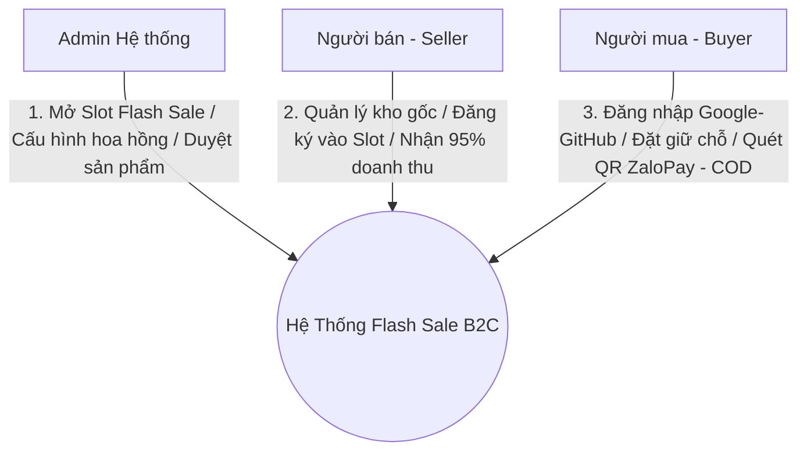
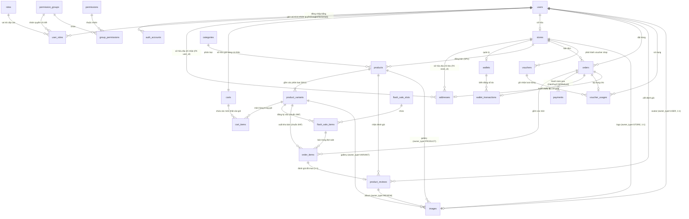

# BƯỚC 2: TÀI LIỆU ĐẶC TẢ YÊU CẦU HỆ THỐNG (SRS)
## Đề tài: Hệ thống Sàn Flash Sale B2C Chống Over-selling bằng Distributed Lock trên Redis

---

* **Học phần:** Đồ án Kỹ thuật Phần mềm / Hệ thống Phân tán
* **Cơ sở đào tạo:** Trường Đại học Giao thông Vận tải Phân hiệu tại TP.HCM (UTC2)
* **Giai đoạn:** Bước 2 - Phân tích yêu cầu (SDLC Phase 2: Requirement Analysis & SRS)
* **Mô hình kiến trúc nghiệp vụ:** Multi-vendor B2C Marketplace (Sàn TMĐT Đa người bán)
* **Phương thức thanh toán:** Hỗ trợ Cổng Thanh toán Online thực tế (ZaloPay QR) & Thanh toán khi nhận hàng (COD).
* **Phương thức xác thực:** Đăng nhập truyền thống & Đăng nhập mạng xã hội OAuth2 (Google, Facebook, GitHub).

---

## 1. Tổng quan & Định vị Hệ thống (System Overview)

Hệ thống là một **Sàn giao dịch thương mại điện tử B2C tập trung vào các sự kiện Flash Sale chịu tải cao**. 
Hệ thống kết nối 3 đối tượng người dùng:
1. **Admin hệ thống (System Administrator / Platform Owner):** Điều phối toàn sàn, mở các khung giờ Flash Sale, kiểm duyệt sản phẩm của người bán, cấu hình tỷ lệ hoa hồng linh hoạt và thu phí giao dịch.
2. **Người bán (Seller / Merchant):** Đăng ký gian hàng, quản lý kho hàng gốc, nộp sản phẩm tham gia các khung giờ Flash Sale với giá giảm sâu, theo dõi đơn hàng và doanh thu ví shop sau khi cấn trừ hoa hồng sàn.
3. **Người mua (Buyer / Consumer):** Đăng nhập nhanh bằng Google/GitHub hoặc tài khoản sàn, trải nghiệm Storefront với đồng hồ đếm ngược và thanh tồn kho nhảy số realtime qua WebSocket, bấm "Mua ngay" để giữ chỗ tồn kho (TTL), quét mã QR ZaloPay hoặc chọn COD để mua hàng.

---

## 2. Bóc tách Tác nhân Hệ thống (Actor Profiles & RBAC)

| Tác nhân (Actor) | Vai trò & Trách nhiệm chính |
| :--- | :--- |
| **System Admin** | • Quản lý tài khoản toàn sàn (kích hoạt/khóa Seller, Buyer). • Tạo và quản lý các **Khung giờ Flash Sale (Flash Sale Slots)**. • Phê duyệt hoặc từ chối sản phẩm người bán đăng ký tham gia Flash Sale. • Cấu hình **Tỷ lệ hoa hồng (Commission Rate)** linh hoạt (mặc định toàn sàn 5%, hoặc override theo shop/ngành hàng). • Giám sát sổ cái đối soát doanh thu, hoa hồng và lượng traffic toàn sàn. |
| **Người bán (Seller)** | • Quản lý gian hàng (`stores`) và kho hàng gốc (`products`). • Chọn sản phẩm đăng ký tham gia vào khung giờ Flash Sale do Admin mở. • Quản lý đơn hàng phát sinh từ chiến dịch. • Theo dõi ví doanh thu (`wallets`): Nhận tiền sau khi sàn đã cấn trừ hoa hồng giao dịch. |
| **Người mua (Buyer)** | • Đăng ký / Đăng nhập qua Local (Email/Password) hoặc OAuth2 (Google, Facebook, GitHub). • Trải nghiệm Storefront: Countdown đếm ngược, số lượng tồn kho giảm dần realtime qua WebSocket. • Nhấn "Mua ngay" để **giữ chỗ tồn kho trong thời gian giới hạn (TTL 5 phút)**. • Chọn thanh toán qua **Quét mã QR ZaloPay** hoặc **COD (Tiền mặt khi nhận hàng)**. |

---

## 3. Danh sách Yêu cầu Chức năng (Functional Requirements - FR)

### Phân hệ 1: Xác thực, Phân quyền & Định danh Đa nền tảng (Auth & RBAC)
* **FR-1.1 (Local Auth):** Đăng ký, đăng nhập bằng Email/Password, mã hóa mật khẩu bằng BCrypt, cấp JWT Token.
* **FR-1.2 (Social Login OAuth2):** Hỗ trợ đăng nhập một chạm qua **Google, Facebook, GitHub**. Lưu vết định danh vào bảng `auth_accounts`. Tự động tạo hồ sơ `users` nếu lần đầu đăng nhập.
* **FR-1.3 (RBAC đa vai trò):** Quản lý quyền hạn thông qua bảng `roles` và `user_roles`. Một tài khoản có thể vừa mang vai trò `ROLE_BUYER` (đi mua deal), vừa mang vai trò `ROLE_SELLER` (quản lý gian hàng).
* **FR-1.4 (Nhóm Quyền Chức Năng Độc Lập - Permission Groups):** Hỗ trợ tạo các nhóm quyền độc lập không phụ thuộc Role (`permission_groups`) và gom các quyền nguyên tử (`permissions`) qua bảng `group_permissions`. Bảng `user_roles` liên kết trực tiếp với `permission_group_id` để phân quyền linh hoạt theo từng tác vụ (vd: Nhân viên A thuộc Role SELLER nhưng chỉ có Nhóm quyền "Quản lý kho", Nhân viên B có Nhóm quyền "Kế toán"). Ràng buộc duy nhất áp dụng `UNIQUE NULLS NOT DISTINCT (user_id, role_id, permission_group_id)` để ngăn trùng lặp bản ghi kể cả khi `permission_group_id` mang giá trị NULL (với Buyer).
* **FR-1.5 (Cơ Chế Khóa Tính Năng Động - Feature Toggle):** Mỗi quyền trong bảng `permissions` sở hữu cờ `is_active`. Bất kỳ tính năng nào chưa phát triển xong hoặc đang bảo trì sẽ được tắt cờ (`is_active = FALSE`). Hệ thống tự động chặn truy cập tại Security Filter và trả về thông báo lỗi thân thiện thay vì gây lỗi sập hệ thống (HTTP 500).
* **FR-1.6 (Sổ Địa Chỉ Chuẩn Hóa Khóa Ngoại & Tọa Độ GPS):** Quản lý sổ địa chỉ tập trung qua bảng `addresses` với 2 khóa ngoại vật lý độc lập `user_id` và `store_id` (kèm ràng buộc `CHECK` loại trừ XOR) đảm bảo tính toàn vẹn tham chiếu cấp RDBMS và tự động xóa theo tầng (`CASCADE`). Hỗ trợ lưu trữ tọa độ GPS (`latitude`, `longitude`) phục vụ tính khoảng cách vận chuyển. Áp dụng cho cả Người mua (lưu nhiều địa chỉ giao hàng, có cờ `is_default` để mua 1-click) và Gian hàng (địa chỉ kho lấy hàng cho shipper). Khi chốt đơn, snapshot địa chỉ được lưu cố định vào `orders`. Quyền sở hữu địa chỉ của người đặt đơn (`address.user_id == current_user.id`) được kiểm tra tại tầng Service trước khi tạo đơn.

### Phân hệ 2: Quản lý Phiên Flash Sale (Slot Management - Admin)
* **FR-2.1:** Admin tạo khung giờ Flash Sale (Tên phiên, Giờ bắt đầu, Giờ kết thúc, Thời gian giữ kho `reservation_ttl_seconds`, Trạng thái: *Dự kiến*, *Đang mở đăng ký*, *Đang diễn ra*, *Đã kết thúc*).
* **FR-2.2:** Admin duyệt (Approve) hoặc từ chối (Reject) kèm lý do đối với các sản phẩm do Seller gửi tham gia phiên. Khi duyệt, hệ thống tự động trừ trực tiếp số lượng `allocated_stock` từ kho gốc `product_variants.stock_quantity`. Seller không được phép tự ý giảm tồn kho gốc làm phá vỡ lượng đã phân bổ cho phiên sale.
* **FR-2.3:** Tự động nạp (Pre-warm) dữ liệu tồn kho của các sản phẩm đã duyệt lên Redis In-Memory trước khi phiên diễn ra 5 phút (đảm bảo tính idempotent, không tạo stock vượt mức phân bổ dù nạp lại nhiều lần).
* **FR-2.4 (Tác vụ Ngầm Tự Động Hoàn Kho Hàng Ế - Unsold Stock Rollback):** Khi phiên Flash Sale kết thúc (`end_time`), Cron Job tự động quét các mục sale còn dư (`available_stock > 0`), cộng hoàn số lượng tồn kho chưa bán được này về lại kho gốc `product_variants.stock_quantity`, đổi trạng thái mục sale thành `ENDED` và giải phóng key cache Redis. Thao tác hoàn kho chỉ thực thi đúng 1 lần (Idempotent).

### Phân hệ 3: Sản phẩm & Đăng ký Chiến dịch theo Mô hình SPU - SKU (Seller)
* **FR-3.1 (Mô hình SPU - SKU):** Người bán quản lý danh mục sản phẩm gốc (`products` - SPU) và các biến thể phân loại hàng hóa (`product_variants` - SKU). Hỗ trợ cấu hình phân loại 2 tầng (`tier_variation_configs`, ví dụ: Màu sắc $\times$ Kích thước). Mỗi biến thể quản lý độc lập mã SKU, giá bán lẻ gốc và tồn kho thực tế.
* **FR-3.2 (Đăng ký Flash Sale theo Biến thể):** Người bán gửi yêu cầu tham gia Flash Sale chi tiết đến từng biến thể SKU (`variant_id`): Chọn slot, định giá sốc riêng cho biến thể, số lượng trích từ kho biến thể sang mở bán (`allocated_stock`), giới hạn số lượng mua trên mỗi khách. Ràng buộc `0 <= available_stock <= allocated_stock` được bảo vệ ở cấp CSDL.
* **FR-3.3 (Quản lý Ảnh Đa đối tượng qua bảng `images` Polymorphic):**
  * Tất cả ảnh của sản phẩm (Product gallery, Variant gallery, User avatar, Store logo, Review album) được quản lý tập trung qua **bảng `images`** với cặp khóa "polymorphic" `(owner_type, owner_id)`.
  * **5 loại owner_type**: `PRODUCT`, `VARIANT`, `USER`, `STORE`, `REVIEW`.
  * **Quy tắc 1-1 (Partial Unique Index)**:
    - 1 `USER` chỉ có tối đa 1 avatar ACTIVE: `UNIQUE (owner_id) WHERE owner_type='USER' AND status='ACTIVE'`.
    - 1 `STORE` chỉ có tối đa 1 logo ACTIVE: `UNIQUE (owner_id) WHERE owner_type='STORE' AND status='ACTIVE'`.
    - 1 `PRODUCT`/`VARIANT` chỉ có tối đa 1 ảnh primary ACTIVE: `UNIQUE (owner_type, owner_id) WHERE owner_type IN ('PRODUCT','VARIANT') AND is_primary=TRUE AND status='ACTIVE'`.
  * **Quy tắc 1-N**: `REVIEW` cho phép nhiều ảnh trong album (không giới hạn, sắp xếp theo `display_order`).
  * **Tích hợp Cloudinary**: Ảnh vật lý lưu trên Cloudinary. Bảng lưu `url` (hiển thị) và `cloudinary_public_id` (để gọi API destroy khi xóa).
  * **Soft delete + Scheduled Cleanup**: Xóa ảnh set `status='INACTIVE'` (sync) → phát event async → Cloudinary destroy → flag `cloudinary_deleted=true` → Sau 30 ngày, scheduled job dọn record `INACTIVE AND cloudinary_deleted=true AND updated_at < NOW()-30 days`.
  * **Tính toàn vẹn tham chiếu**: Do polymorphic không tạo được FK vật lý tới 5 bảng owner, Service **bắt buộc validate** `owner_id` tồn tại trong bảng tương ứng (theo `owner_type`) trước khi insert.
  * Khi xóa owner (Product/Store/Review/User), Service phải soft delete tất cả `images` có `owner_id` tương ứng để tránh ảnh mồ côi trên Cloudinary.

### Phân hệ 4: Lõi Đặt hàng, Khóa Tồn kho & Giữ chỗ (Reservation & Anti-Overselling Core)
* **FR-4.1 (Kiểm tra Giới hạn Mua - Purchase Limit Check):** Khi Buyer nhấn mua, hệ thống kiểm tra key `flash_sale:user_limit:{slotId}:{userId}:{itemId}` trên Redis xem Buyer đã đạt trần mua trong phiên hay chưa. Giới hạn này có thời gian sống (TTL) tương ứng với thời lượng còn lại của phiên Flash Sale (`slot.end_time - now()`), độc lập với thời gian giữ chỗ đơn hàng (Reservation TTL 300 giây).
* **FR-4.2 (Khóa và Trừ Kho Nguyên Tử - Atomic Reservation):**
  * Sử dụng **Redis Lua Script** hoặc **Redisson Distributed Lock** để kiểm tra và trừ tồn kho khả dụng nguyên tử trên Redis.
  * Nếu tồn kho trên Redis không đủ $\rightarrow$ Trả về thông báo "Hết hàng" ngay trong vòng < 50ms, không truy vấn ghi xuống Database.
* **FR-4.3 (Tạo Đơn Giữ Chỗ & Bù Hoàn Khi Lỗi - Try-Catch Compensation):**
  * Tạo bản ghi `orders` ở trạng thái `PENDING_PAYMENT` kèm `expires_at = now() + 5 phút` (Reservation TTL).
  * **Cơ chế Bù hoàn (Compensation):** Nếu bước trừ kho trên Redis thành công nhưng câu lệnh INSERT đơn hàng xuống Database bị thất bại (lỗi kết nối, timeout, server crash), tầng Service kích hoạt bù hoàn ngay lập tức: hoàn lại số lượng tồn kho trên Redis (`INCRBY stock {quantity}`) và giải phóng hạn mức mua tương ứng của user trên Redis.

### Phân hệ 5: Xử lý Đa Cổng Thanh toán & Vòng đời Đơn hàng (Payments & Order Lifecycle)
* **FR-5.1 (Tích hợp Cổng ZaloPay - Quét mã QR & Chống Thanh toán Trùng):**
  * Gọi API ZaloPay sinh mã `app_trans_id` và chuỗi dữ liệu QR.
  * Lưu thông tin vào bảng `payments` ở trạng thái `PENDING`.
  * Storefront hiển thị mã QR ZaloPay động kèm đồng hồ đếm ngược 5:00 để khách quét trên điện thoại.
  * Đón nhận **Webhook Callback** từ ZaloPay, xác thực HMAC SHA256, xử lý Idempotent. Ràng buộc cơ sở dữ liệu (Partial Unique Index) đảm bảo mỗi đơn hàng chỉ có **tối đa duy nhất 1 bản ghi thanh toán ở trạng thái `SUCCESS`**, đồng thời vẫn hỗ trợ người dùng retry thanh toán nhiều lần nếu thất bại trước đó.
* **FR-5.2 (Thanh toán COD - Tiền mặt):**
  * Khách chọn COD $\rightarrow$ Đơn hàng chuyển thẳng sang `CONFIRMED`, kho trên Redis được chốt trừ vĩnh viễn (không bị hủy do hết hạn 5 phút).
* **FR-5.3 (Cơ chế Tự động Hoàn kho khi Quá hạn - Rollback Timeout):**
  * Nếu sau 5 phút khách chọn Online mà không thanh toán thành công:
  * Hệ thống tự động chuyển `orders.status = CANCELLED_TIMEOUT`, `payments.status = FAILED`.
  * Kích hoạt hoàn kho trên Redis theo đúng số lượng đã giữ chỗ (`INCRBY stock {order_item.quantity}`), giảm trừ số lượng đã giữ chỗ trong key giới hạn mua của khách (`DECRBY user_limit {quantity}`).
  * Phát tín hiệu qua WebSocket thông báo số lượng tồn kho khả dụng tăng lên cho các khách khác tiếp tục săn deal.
* **FR-5.4 (Xử lý Hoàn tiền - Refund):**
  * Đối với các đơn hàng đã thanh toán Online qua ZaloPay bị hủy bởi shop (hết hàng, sự cố) hoặc hủy hợp lệ trước khi giao:
  * Hệ thống chuyển `payments.status = REFUNDED`, lưu vết thời gian `refunded_at` và lý do `refund_reason` để hỗ trợ đối soát kế toán.

### Phân hệ 6: Quản lý Tài chính & Hoa hồng Sàn (Commission & Wallet Settlement)
* **FR-6.1:** Admin cấu hình tỷ lệ hoa hồng linh hoạt: Cố định toàn sàn (mặc định 5%), hoặc cấu hình riêng cho từng Store (`stores.default_commission_rate`), hoặc cấu hình riêng theo từng sản phẩm sale.
* **FR-6.2:** Khi đơn hàng thành công (`PAID` đối với Online hoặc `COMPLETED` đối với COD):
  * Hệ thống tính toán dòng tiền: Hoa hồng sàn = 5%, Tiền người bán = 95%.
  * Tự động cộng tiền vào ví `wallets` của Người bán.
  * Lưu vết giao dịch vào sổ cái `wallet_transactions` để phục vụ đối soát minh bạch.

### Phân hệ 7: Giỏ Hàng, Tách Đơn & Mua Hàng Tiêu Chuẩn (Cart, Order Splitting & Purchasing)
* **FR-7.1 (Giỏ hàng Cá nhân - Carts):** Mỗi Người mua sở hữu 1 giỏ hàng duy nhất (`carts`). Cho phép chọn lưu trữ nhiều biến thể sản phẩm (`cart_items`) với số lượng tùy chọn để mua gom nhiều món.
* **FR-7.2 (Quy tắc Tách đơn Đa Gian hàng - Multi-Vendor Order Splitting):** Mỗi bản ghi `orders` thuộc về duy nhất 1 gian hàng (`store_id`). Khi người mua thanh toán một giỏ hàng chứa sản phẩm của nhiều Shop khác nhau, Checkout Service tự động phân nhóm các `cart_items` theo `store_id` và tạo $N$ đơn hàng độc lập tương ứng trong bảng `orders`, đảm bảo mỗi đơn hàng chỉ chứa sản phẩm của đúng một gian hàng.
* **FR-7.3 (Đặt hàng Hàng thường & Hàng Flash Sale):** Bảng `orders` cho phép `slot_id = NULL` khi mua hàng theo giá niêm yết thông thường; gán `slot_id` cụ thể khi đặt hàng săn deal Flash Sale (kích hoạt giữ chỗ 5 phút). Khi tạo đơn Flash Sale, Service tự động lấy `slot_id` và `variant_id` từ chính bản ghi `flash_sale_items` tin cậy trong DB, không nhận từ payload của client.

### Phân hệ 8: Quản lý Mã Giảm Giá & Khuyến Mãi (Voucher & Promotions)
* **FR-8.1 (Phát hành Voucher):**
  * Admin phát hành Voucher Toàn sàn (Platform Voucher - `store_id = NULL`).
  * Seller phát hành Voucher của Shop (Shop Voucher - `store_id` trỏ về shop tương ứng).
  * Hỗ trợ 2 hình thức: Giảm theo phần trăm (`PERCENT`, giá trị $\le 100\%$, kèm mức giảm tối đa) hoặc Giảm số tiền cố định (`FIXED_AMOUNT`).
  * Ràng buộc dữ liệu đảm bảo `used_quantity <= total_quantity`.
* **FR-8.2 (Áp dụng Voucher & Quy tắc Gian hàng):**
  * Khi áp dụng voucher, hệ thống kiểm tra điều kiện đơn tối thiểu và quota. Nếu `voucher.store_id IS NOT NULL` (Voucher của Shop), Checkout Service bắt buộc xác thực `voucher.store_id == order.store_id`, ngăn chặn việc dùng voucher của shop này cho đơn của shop khác.
  * Ghi nhận lịch sử sử dụng vào bảng `voucher_usages`.
* **FR-8.3 (Cơ chế Bồi hoàn Voucher khi Hủy đơn):**
  * Nếu đơn hàng bị hủy do quá hạn thanh toán 5 phút (`CANCELLED_TIMEOUT`) hoặc người mua chủ động hủy:
  * Hệ thống tự động hoàn lại lượt dùng cho khách và giảm lại số lượng đã dùng của voucher (`used_quantity = used_quantity - 1`).

### Phân hệ 9: Đánh giá & Phản hồi Khách hàng (Reviews & Ratings)
* **FR-9.1 (Đánh giá Đã Mua Hàng - Verified Purchase Review):** Chỉ những khách hàng đã mua sản phẩm và đơn hàng đã hoàn tất (`status = 'COMPLETED'`) mới được quyền gửi đánh giá cho từng món hàng trong đơn (`order_item_id`). Khóa ngoại duy nhất `order_item_id UNIQUE` đảm bảo mỗi món trong đơn chỉ được đánh giá 1 lần duy nhất, chống spam và review ảo.
* **FR-9.2 (Tối ưu hóa Truy vấn Đọc - Read Optimization):** Bảng `product_reviews` lưu trữ trực tiếp `product_id` (phi chuẩn hóa có chủ đích) nhằm tối ưu hóa câu truy vấn hiển thị danh sách đánh giá trên trang chi tiết sản phẩm Storefront mà không phải JOIN qua 3 bảng lớn. Service đảm bảo tính toàn vẹn bằng cách xác thực `order_item` thuộc đúng sản phẩm và người đánh giá là chủ sở hữu đơn hàng.
* **FR-9.3 (Chấm điểm, Ảnh Feedback & Phản hồi của Shop):** Người mua chấm điểm từ 1 đến 5 sao (`rating`), viết nhận xét (`comment`). Album ảnh chụp thực tế do khách đính kèm được lưu ở bảng `images` với `owner_type='REVIEW'` (xem FR-3.3). Chủ gian hàng có quyền gửi phản hồi chăm sóc khách hàng (`seller_reply`). Quản trị viên có thể ẩn các đánh giá vi phạm từ ngữ (`status = HIDDEN`).

---

## 4. Bảng Danh mục Cơ sở Dữ liệu Tổng thể (25 bảng)

| STT | Bảng dữ liệu | Chức năng chính & Ràng buộc cốt lõi |
| :---: | :--- | :--- |
| 1 | **`users`** | Hồ sơ tài khoản người dùng cốt lõi (Email, Mật khẩu BCrypt, Họ tên, SĐT, Trạng thái). |
| 2 | **`roles`** | Danh mục vai trò cấp cao (`ROLE_ADMIN`, `ROLE_SELLER`, `ROLE_BUYER`). |
| 3 | **`user_roles`** | Bảng trung gian ma trận gán Role và **Nhóm quyền (`permission_group_id`)**, áp dụng `UNIQUE NULLS NOT DISTINCT (user_id, role_id, permission_group_id)`. |
| 4 | **`permission_groups`** | Nhóm quyền nghiệp vụ độc lập không phụ thuộc Role (Kho, Kế toán, Flash Sale...). |
| 5 | **`permissions`** | Danh mục quyền nguyên tử kèm cờ `is_active` để khóa tính năng chưa xong. |
| 6 | **`group_permissions`** | Bảng nối gom các quyền nguyên tử vào nhóm quyền tương ứng. |
| 7 | **`auth_accounts`** | Quản lý tài khoản đăng nhập bên thứ ba (Google, Facebook, GitHub, Local). |
| 8 | **`addresses`** | Sổ địa chỉ chuẩn hóa với 2 khóa ngoại vật lý (`user_id`, `store_id`), CHECK loại trừ XOR và tọa độ GPS. |
| 9 | **`stores`** | Thông tin gian hàng của Seller, tỷ lệ hoa hồng riêng của shop. |
| 10 | **`wallets`** | Ví tiền của Seller (số dư khả dụng, số dư đóng băng). |
| 11 | **`categories`** | Danh mục ngành hàng (Thời trang, Điện tử, Đồ gia dụng...). |
| 12 | **`products`** | Thông tin sản phẩm gốc SPU (tên, ngành hàng, mô tả, cấu hình phân loại 2 cấp `tier_variation_configs`). |
| 13 | **`product_variants`** | Chi tiết từng biến thể SKU (quản lý mã SKU, giá bán lẻ gốc, tồn kho thực tế, thuộc tính JSONB Màu x Size). |
| 14 | **`flash_sale_slots`** | Khung giờ Flash Sale do Admin tạo (thời gian bắt đầu, kết thúc, TTL giữ kho `reservation_ttl_seconds`). |
| 15 | **`flash_sale_items`** | Biến thể SKU tham gia Flash Sale (liên kết `variant_id`, nạp tồn kho lên Redis, `CHECK (available_stock >= 0 AND available_stock <= allocated_stock)`). |
| 16 | **`orders`** | Đơn đặt hàng (Mỗi đơn thuộc 1 `store_id`, `slot_id` cho phép NULL, lưu immutable snapshot địa chỉ và tiền hàng, `shipping_address_id ON DELETE SET NULL`). |
| 17 | **`order_items`** | Chi tiết từng biến thể SKU được mua và lưu immutable snapshot giá, tên tại thời điểm chốt đơn. |
| 18 | **`payments`** | Lịch sử thanh toán cổng ZaloPay QR & COD, hỗ trợ hoàn tiền (Refund), retry, Webhook Idempotent và Partial Unique Index đảm bảo tối đa 1 bản ghi `SUCCESS` cho mỗi đơn. |
| 19 | **`wallet_transactions`** | Sổ cái tài chính bất biến ghi nhận cộng tiền ví Seller và trích thu hoa hồng sàn 5% minh bạch. |
| 20 | **`vouchers`** | Danh mục mã giảm giá (Voucher Sàn & Voucher Shop, `CHECK (used_quantity <= total_quantity)`, `CHECK (discount_value <= 100)` nếu là PERCENT). |
| 21 | **`voucher_usages`** | Lịch sử sử dụng voucher theo từng đơn hàng và người dùng (`order_id UNIQUE`). |
| 22 | **`carts`** | Giỏ hàng cá nhân của Người mua (Quan hệ 1-1 với `users`). |
| 23 | **`cart_items`** | Chi tiết từng biến thể SKU nhặt vào giỏ hàng (`cart_id`, `variant_id`, `quantity`). |
| 24 | **`product_reviews`** | Đánh giá sản phẩm đã mua (1-5 sao, nhận xét, `order_item_id UNIQUE` đảm bảo Verified Purchase 1-1, lưu `product_id` để tối ưu truy vấn đọc). Album ảnh feedback lưu ở bảng `images`. |
| 25 | **`images`** | Quản lý ảnh đa đối tượng Polymorphic với Cloudinary (avatar User, logo Store, gallery Product/Variant, album Review). Cặp `(owner_type, owner_id)` tham chiếu mềm tới 5 bảng owner. Partial Unique Index cho User (1 avatar), Store (1 logo), Product/Variant (1 primary). Soft delete (`status='INACTIVE'`) + async Cloudinary cleanup + scheduled job dọn record >30 ngày. |

---

## 5. Yêu cầu Phi Chức năng (Non-Functional Requirements - NFR)

* **Kiểm soát Over-selling:** Đảm bảo tính nhất quán của số lượng tồn kho, ngăn ngừa hiện tượng bán vượt quá số lượng mở bán dù chịu tải đồng thời hàng nghìn request/giây.
* **Thời gian phản hồi P99:** Dưới **500ms** cho API giữ chỗ tồn kho trên Redis trong điều kiện tải đỉnh.
* **Bảo mật thanh toán:** Toàn bộ dữ liệu Callback từ cổng ZaloPay phải được kiểm tra chữ ký mã hóa (Checksum HMAC-SHA256) trước khi xử lý đổi trạng thái đơn.
* **Độ trễ truyền tin Realtime:** Dưới **100ms** thông qua WebSocket STOMP.
