# BƯỚC 3: THIẾT KẾ HỆ THỐNG & CƠ SỞ DỮ LIỆU (SYSTEM & DATABASE DESIGN)
## Đề tài: Hệ thống Sàn Flash Sale B2C Chống Over-selling bằng Distributed Lock trên Redis

---

* **Học phần:** Đồ án Kỹ thuật Phần mềm / Hệ thống Phân tán
* **Cơ sở đào tạo:** Trường Đại học Giao thông Vận tải Phân hiệu tại TP.HCM (UTC2)
* **Giai đoạn:** Bước 3 - Thiết kế Hệ thống & CSDL (SDLC Phase 3: System & Database Design)
* **Hệ quản trị CSDL:** PostgreSQL 16+
* **Chuẩn thiết kế dữ liệu:** Chuẩn hóa cấp 3 (3NF - Third Normal Form)
* **Tầng Cache & Concurrency:** Redis In-Memory (Lua Scripting & Redisson Distributed Lock)
* **Quy mô CSDL:** 25 Bảng dữ liệu hoàn chỉnh (Hỗ trợ Đa người bán, Hoa hồng sàn, Mô hình biến thể phân loại hàng SPU - SKU chuẩn TMĐT, Giỏ hàng Shopping Cart, Đánh giá & Phản hồi Verified Reviews, ZaloPay/COD, OAuth2, Phân quyền Ma trận RBAC kèm Permission Groups & Cờ khóa tính năng, Sổ địa chỉ chuẩn hóa 2 Khóa ngoại vật lý kèm tọa độ GPS, Phân hệ Khuyến mãi Voucher, Quản lý Ảnh đa đối tượng Polymorphic với Cloudinary)

---

## 1. Nguyên lý Chuẩn hóa 3NF (Third Normal Form Proof)

Cơ sở dữ liệu của hệ thống bao gồm **25 bảng**, được thiết kế tuân thủ nghiêm ngặt chuẩn hóa cấp 3 (3NF):

1. **Chuẩn 1 (1NF - First Normal Form):**
   * Mọi thuộc tính đều mang giá trị nguyên tử (Atomic values), không có cột đa trị (ví dụ: danh sách món hàng tách thành `order_items`, biến thể SKU tách thành `product_variants`, món hàng trong giỏ tách thành `cart_items`, đánh giá tách thành `product_reviews`, lượt dùng voucher tách thành `voucher_usages`, phân bổ quyền tách thành `group_permissions`, địa chỉ tách thành bảng `addresses`).
   * Không có nhóm lặp thuộc tính (Repeating groups). Các trường `JSONB` như `tier_variation_configs`, `attributes` chỉ đóng vai trò lưu metadata động phục vụ hiển thị UI và cấu hình phân loại tùy biến, trong khi mã định danh SKU, giá bán lẻ, tồn kho và các thực thể đánh giá đều được nguyên tử hóa và chuẩn hóa triệt để. Ảnh của tất cả các đối tượng (Product gallery, Variant gallery, User avatar, Store logo, Review album) được quản lý tập trung qua bảng `images` polymorphic.
2. **Chuẩn 2 (2NF - Second Normal Form):**
   * Đã đạt 1NF.
   * Toàn bộ các thuộc tính không khóa đều phụ thuộc hàm đầy đủ vào khóa chính (Full Functional Dependency).
   * **Phân rã SPU - SKU:** Giá niêm yết (`original_price`) và tồn kho (`stock_quantity`) phụ thuộc vào từng biến thể cụ thể (SKU) chứ không phụ thuộc vào sản phẩm chung (SPU). Do đó, chúng được đưa xuống bảng `product_variants`, loại bỏ hoàn toàn phụ thuộc bộ phận (Partial Dependency).
   * Đối với các bảng nối có khóa chính phức hợp như `group_permissions (group_id, permission_id)`, thuộc tính bổ trợ `assigned_at` phụ thuộc vào cả cặp khóa.
3. **Chuẩn 3 (3NF - Third Normal Form):**
   * Đã đạt 2NF.
   * **Không tồn tại phụ thuộc bắc cầu (Transitive Dependency)**: Không có thuộc tính không khóa nào phụ thuộc vào một thuộc tính không khóa khác.
   * *Ví dụ thực tế và các quyết định chuẩn hóa cốt lõi:* 
     * **Bảng `addresses` (Khóa Ngoại Vật Lý & Loại Trừ XOR):** Thay vì dùng mô hình đa hình phi quan hệ (`owner_type`, `owner_id`) không thể tạo ràng buộc khóa ngoại, bảng được thiết kế 2 Khóa ngoại vật lý độc lập `user_id FK` và `store_id FK` kèm ràng buộc toàn vẹn `CHECK ((user_id IS NOT NULL AND store_id IS NULL) OR (user_id IS NULL AND store_id IS NOT NULL))`. Ràng buộc này đảm bảo toàn vẹn tham chiếu cấp vật lý (Physical Foreign Keys) và tính loại trừ XOR giữa Người mua và Gian hàng, loại bỏ nguy cơ dữ liệu mồ côi (Orphan Records). Quyền sở hữu địa chỉ của người đặt đơn hàng (`address.user_id == current_user.id`) được kiểm tra tại tầng Service trước khi tạo đơn.
     * **Bảng `flash_sale_items` & `order_items` (Khử phụ thuộc bắc cầu về cấu trúc quan hệ):** Bảng `flash_sale_items` tuân thủ chuẩn 3NF về mặt cấu trúc quan hệ, loại bỏ các thuộc tính có thể suy diễn thông qua quan hệ $variant \rightarrow product \rightarrow store$. Tương tự, `order_items` chỉ tham chiếu `variant_id`, không lưu thừa `product_id`. Các ràng buộc nghiệp vụ liên bảng (như kiểm tra biến thể thuộc đúng đợt sale hay đúng gian hàng) được kiểm soát đồng bộ tại tầng Service khi khởi tạo giao dịch.
     * **Bảo toàn dữ liệu lịch sử (Historical Snapshots):** Các trường lưu tên, địa chỉ, giá mua trong `order_items` (`product_name`, `variant_name`, `price_at_purchase`) và thông tin thanh toán, hoa hồng trong `orders` (`subtotal_amount`, `voucher_discount_amount`, `total_amount`, `commission_rate`, `platform_fee`, `seller_amount`, `recipient_name`, `recipient_phone`, `shipping_address_text`) **hoàn toàn không vi phạm 3NF**. Đây là các bản chụp dữ liệu lịch sử bất biến (Immutable Temporal Snapshots) tại thời điểm giao dịch phát sinh. Nếu suy diễn động từ bảng sản phẩm hoặc gian hàng hiện tại, khi người bán đổi giá/đổi tên hoặc sàn nâng tỷ lệ hoa hồng, toàn bộ dữ liệu kế toán và lịch sử giao dịch quá khứ sẽ bị sai lệch.
     * **Bảng `orders`:** Cột `slot_id` cho phép nhận giá trị `NULL` để hỗ trợ cả đơn hàng mua lẻ bình thường ngoài khung giờ sale lẫn đơn hàng săn deal Flash Sale giữ kho 5 phút.
     * **Phân hệ Giỏ hàng (`carts`, `cart_items`):** Tách bạch giỏ hàng của từng khách hàng và từng món hàng, chuẩn hóa quan hệ $1-1$ và $1-N$.
     * **Phân hệ Đánh giá (`product_reviews`) & Tối ưu hóa truy vấn đọc (Read Optimization):** Chuẩn hóa quan hệ $1-1$ với `order_items` qua ràng buộc `UNIQUE (order_item_id)`, đảm bảo cơ chế Verified Purchase (chỉ người đã mua món hàng cụ thể mới được đánh giá) và không cho phép đánh giá lặp lại. Việc lưu thêm `product_id` là một quyết định phi chuẩn hóa có chủ đích (Intentional Denormalization) nhằm phục vụ truy vấn hiển thị đánh giá theo sản phẩm với hiệu năng cao trên Storefront mà không phải JOIN qua 3 bảng lớn, với tính toàn vẹn được đảm bảo thông qua kiểm tra chéo tại tầng Service.

---

## 2. Sơ đồ Thực thể Liên kết (Mermaid Entity Relationship Diagram)

```mermaid
erDiagram
    ROLES {
        smallint id PK
        varchar name UK
        varchar description
        timestamptz created_at
    }

    USERS {
        bigint id PK
        varchar email UK
        varchar password_hash
        varchar full_name
        varchar phone UK
        varchar avatar_url
        varchar status
        timestamptz created_at
        timestamptz updated_at
    }

    PERMISSION_GROUPS {
        int id PK
        varchar name UK
        varchar description
        timestamptz created_at
    }

    PERMISSIONS {
        int id PK
        varchar code UK
        varchar name
        varchar module
        boolean is_active
        timestamptz created_at
    }

    GROUP_PERMISSIONS {
        int group_id PK,FK
        int permission_id PK,FK
        timestamptz assigned_at
    }

    USER_ROLES {
        bigint id PK
        bigint user_id FK
        smallint role_id FK
        int permission_group_id FK
        timestamptz assigned_at
    }

    AUTH_ACCOUNTS {
        bigint id PK
        bigint user_id FK
        varchar provider
        varchar provider_account_id
        varchar provider_email
        timestamptz created_at
    }

    ADDRESSES {
        bigint id PK
        bigint user_id FK
        bigint store_id FK
        varchar contact_name
        varchar phone
        varchar province
        varchar district
        varchar ward
        varchar detail_address
        decimal latitude
        decimal longitude
        boolean is_default
        timestamptz created_at
        timestamptz updated_at
    }

    CARTS {
        bigint id PK
        bigint user_id FK,UK
        timestamptz created_at
        timestamptz updated_at
    }

    CART_ITEMS {
        bigint id PK
        bigint cart_id FK
        bigint variant_id FK
        int quantity
        timestamptz created_at
        timestamptz updated_at
    }

    STORES {
        bigint id PK
        bigint user_id FK,UK
        varchar store_name UK
        varchar logo_url
        text description
        decimal default_commission_rate
        varchar status
        timestamptz created_at
    }

    WALLETS {
        bigint id PK
        bigint store_id FK,UK
        decimal balance
        decimal frozen_balance
        timestamptz updated_at
    }

    CATEGORIES {
        int id PK
        varchar name UK
        varchar slug UK
        decimal commission_rate
        varchar description
    }

    PRODUCTS {
        bigint id PK
        bigint store_id FK
        int category_id FK
        varchar name
        varchar image_url
        text description
        jsonb tier_variation_configs
        varchar status
        timestamptz created_at
    }

    PRODUCT_VARIANTS {
        bigint id PK
        bigint product_id FK
        varchar sku UK
        varchar variant_name
        jsonb attributes
        decimal original_price
        int stock_quantity
        varchar image_url
        varchar status
        timestamptz created_at
    }

    FLASH_SALE_SLOTS {
        bigint id PK
        varchar title
        timestamptz start_time
        timestamptz end_time
        int reservation_ttl_seconds
        varchar status
        timestamptz created_at
    }

    FLASH_SALE_ITEMS {
        bigint id PK
        bigint slot_id FK
        bigint variant_id FK
        decimal flash_sale_price
        int allocated_stock
        int available_stock
        int user_purchase_limit
        decimal commission_rate_override
        varchar status
        timestamptz created_at
    }

    VOUCHERS {
        bigint id PK
        varchar code UK
        bigint store_id FK
        varchar discount_type
        decimal discount_value
        decimal min_order_amount
        decimal max_discount_amount
        int total_quantity
        int used_quantity
        int user_usage_limit
        timestamptz start_time
        timestamptz end_time
        varchar status
        timestamptz created_at
    }

    VOUCHER_USAGES {
        bigint id PK
        bigint voucher_id FK
        bigint user_id FK
        bigint order_id FK
        decimal discount_amount
        timestamptz used_at
    }

    ORDERS {
        bigint id PK
        varchar order_code UK
        bigint buyer_id FK
        bigint store_id FK
        bigint slot_id FK
        bigint voucher_id FK
        bigint shipping_address_id FK
        varchar recipient_name
        varchar recipient_phone
        text shipping_address_text
        decimal subtotal_amount
        decimal voucher_discount_amount
        decimal total_amount
        decimal commission_rate
        decimal platform_fee
        decimal seller_amount
        varchar status
        timestamptz expires_at
        timestamptz created_at
    }

    ORDER_ITEMS {
        bigint id PK
        bigint order_id FK
        bigint flash_sale_item_id FK
        bigint variant_id FK
        varchar product_name
        varchar variant_name
        decimal price_at_purchase
        int quantity
    }

    PAYMENTS {
        bigint id PK
        bigint order_id FK
        varchar payment_method
        varchar transaction_code UK
        varchar gateway_trans_id
        decimal amount
        text qr_code_data
        text payment_url
        varchar status
        jsonb callback_payload
        timestamptz paid_at
        timestamptz refunded_at
        varchar refund_reason
        timestamptz created_at
    }

    WALLET_TRANSACTIONS {
        bigint id PK
        bigint wallet_id FK
        bigint order_id FK
        bigint payment_id FK
        varchar transaction_type
        decimal amount
        decimal balance_after
        varchar description
        timestamptz created_at
    }

    PRODUCT_REVIEWS {
        bigint id PK
        bigint user_id FK
        bigint product_id FK
        bigint order_item_id FK,UK
        smallint rating
        text comment
        text seller_reply
        timestamptz seller_reply_at
        varchar status
        timestamptz created_at
        timestamptz updated_at
    }

    IMAGES {
        bigint id PK
        varchar owner_type
        bigint owner_id
        varchar url
        varchar cloudinary_public_id
        int display_order
        boolean is_primary
        boolean cloudinary_deleted
        varchar status
        timestamptz created_at
        timestamptz updated_at
    }

    %% QUAN HỆ GIỮA CÁC BẢNG (RELATIONSHIPS)
    USERS ||--o{ USER_ROLES : "gán"
    ROLES ||--o{ USER_ROLES : "vai trò chính"
    PERMISSION_GROUPS ||--o{ USER_ROLES : "nhóm quyền chi tiết"
    PERMISSION_GROUPS ||--o{ GROUP_PERMISSIONS : "chứa các quyền"
    PERMISSIONS ||--o{ GROUP_PERMISSIONS : "thuộc nhóm"
    USERS ||--o{ AUTH_ACCOUNTS : "links"
    USERS ||--o{ ADDRESSES : "sở hữu địa chỉ nhận (FK user_id)"
    STORES ||--o{ ADDRESSES : "sở hữu địa chỉ kho (FK store_id)"
    USERS ||--|| CARTS : "sở hữu giỏ hàng"
    CARTS ||--o{ CART_ITEMS : "chứa các món"
    PRODUCT_VARIANTS ||--o{ CART_ITEMS : "món trong giỏ"
    USERS ||--o| STORES : "owns"
    STORES ||--|| WALLETS : "has"
    CATEGORIES ||--o{ PRODUCTS : "categorizes"
    STORES ||--o{ PRODUCTS : "manages"
    PRODUCTS ||--|{ PRODUCT_VARIANTS : "has_multiple_skus"
    FLASH_SALE_SLOTS ||--o{ FLASH_SALE_ITEMS : "contains"
    PRODUCT_VARIANTS ||--o{ FLASH_SALE_ITEMS : "registers_to"
    USERS ||--o{ ORDERS : "places"
    STORES ||--o{ ORDERS : "fulfills"
    FLASH_SALE_SLOTS ||--o{ ORDERS : "belongs_to"
    ORDERS ||--o{ ORDER_ITEMS : "contains"
    FLASH_SALE_ITEMS ||--o{ ORDER_ITEMS : "sold_in"
    PRODUCT_VARIANTS ||--o{ ORDER_ITEMS : "ordered_as"
    ORDER_ITEMS ||--o| PRODUCT_REVIEWS : "reviewed_in (1-1)"
    PRODUCTS ||--o{ PRODUCT_REVIEWS : "has_reviews"
    USERS ||--o{ PRODUCT_REVIEWS : "writes_reviews"
    ORDERS ||--o{ PAYMENTS : "paid_with"
    WALLETS ||--o{ WALLET_TRANSACTIONS : "tracks"
    ORDERS ||--o| WALLET_TRANSACTIONS : "triggers"
    STORES ||--o{ VOUCHERS : "issues_shop_voucher"
    VOUCHERS ||--o{ VOUCHER_USAGES : "records_usage"
    USERS ||--o{ VOUCHER_USAGES : "uses"
    ORDERS ||--o| VOUCHER_USAGES : "applies"
    VOUCHERS ||--o{ ORDERS : "applied_to"
    ORDERS ||--o| ADDRESSES : "snapshots_from"

    %% Quan he polymorphic: bang images tham chieu den 5 owner types
    %% (vi mermaid ER khong ho tro polymorphic nen tao 5 quan he ly thuyet)
    PRODUCTS         ||--o{ IMAGES : "has_gallery (owner_type=PRODUCT)"
    PRODUCT_VARIANTS ||--o{ IMAGES : "has_gallery (owner_type=VARIANT)"
    USERS            ||--o| IMAGES : "has_avatar (owner_type=USER, 1-1)"
    STORES           ||--o| IMAGES : "has_logo (owner_type=STORE, 1-1)"
    PRODUCT_REVIEWS  ||--o{ IMAGES : "has_album (owner_type=REVIEW)"
```



---

## 3. Chi tiết Thiết kế 25 Bảng CSDL Chuẩn 3NF

---

### PHÂN HỆ 1: XÁC THỰC, PHÂN QUYỀN MA TRẬN & ĐỊA CHỈ (8 BẢNG)

#### 1. Bảng `roles` (Danh mục vai trò người dùng)
* **Chức năng nghiệp vụ:** Định nghĩa vai trò cấp cao (`ROLE_ADMIN`, `ROLE_SELLER`, `ROLE_BUYER`) phục vụ phân luồng truy cập portal trên Spring Security.
* **Cấu trúc trường:**
  | Tên trường | Kiểu dữ liệu | Ràng buộc | Mô tả chi tiết |
  | :--- | :--- | :--- | :--- |
  | `id` | `SMALLSERIAL` | **PRIMARY KEY** | Mã định danh vai trò |
  | `name` | `VARCHAR(30)` | **NOT NULL, UNIQUE** | Tên vai trò: `ROLE_ADMIN`, `ROLE_SELLER`, `ROLE_BUYER` |
  | `description` | `VARCHAR(255)` | NULL | Mô tả quyền hạn của vai trò |
  | `created_at` | `TIMESTAMPTZ` | DEFAULT CURRENT_TIMESTAMP | Thời điểm tạo vai trò |

#### 2. Bảng `users` (Tài khoản người dùng toàn sàn)
* **Chức năng nghiệp vụ:** Lưu trữ thông tin tài khoản cơ sở dùng chung cho Admin, Seller và Buyer.
* **Cấu trúc trường:**
  | Tên trường | Kiểu dữ liệu | Ràng buộc | Mô tả chi tiết |
  | :--- | :--- | :--- | :--- |
  | `id` | `BIGSERIAL` | **PRIMARY KEY** | ID duy nhất của người dùng |
  | `email` | `VARCHAR(100)` | **NOT NULL, UNIQUE** | Email đăng nhập và nhận thông báo |
  | `password_hash` | `VARCHAR(255)` | NULL | Mật khẩu băm BCrypt (Để NULL nếu đăng nhập OAuth2 thuần) |
  | `full_name` | `VARCHAR(100)` | **NOT NULL** | Họ và tên hiển thị |
  | `phone` | `VARCHAR(15)` | UNIQUE, NULL | Số điện thoại liên lạc |
  | ~~`avatar_url`~~ | ~~`VARCHAR(255)`~~ | ~~NULL~~ | **ĐÃ CHUYỂN SANG BẢNG `images`** (owner_type='USER'). Xem Phân hệ 10. |
  | `avatar_url` | `VARCHAR(255)` | NULL | Đường dẫn ảnh đại diện |
  | `status` | `VARCHAR(20)` | DEFAULT 'ACTIVE' | `ACTIVE`, `LOCKED`, `SUSPENDED` |
  | `created_at` | `TIMESTAMPTZ` | DEFAULT CURRENT_TIMESTAMP | Thời điểm đăng ký tài khoản |
  | `updated_at` | `TIMESTAMPTZ` | DEFAULT CURRENT_TIMESTAMP | Thời điểm cập nhật hồ sơ gần nhất |

#### 3. Bảng `permission_groups` (Nhóm quyền chức năng độc lập)
* **Chức năng nghiệp vụ:** Gom các quyền nghiệp vụ lại thành các nhóm độc lập không phụ thuộc cứng vào Role (Ví dụ: "Nhóm Quản lý kho", "Nhóm Kế toán tài chính", "Nhóm Vận hành Flash Sale").
* **Cấu trúc trường:**
  | Tên trường | Kiểu dữ liệu | Ràng buộc | Mô tả chi tiết |
  | :--- | :--- | :--- | :--- |
  | `id` | `SERIAL` | **PRIMARY KEY** | ID nhóm quyền |
  | `name` | `VARCHAR(100)` | **NOT NULL, UNIQUE** | Tên nhóm quyền (VD: "Quản lý Kho", "Kế toán Đối soát") |
  | `description` | `VARCHAR(255)` | NULL | Mô tả nhiệm vụ của nhóm quyền |
  | `created_at` | `TIMESTAMPTZ` | DEFAULT CURRENT_TIMESTAMP | Thời điểm tạo nhóm |

#### 4. Bảng `permissions` (Danh mục quyền nguyên tử kèm cờ khóa tính năng)
* **Chức năng nghiệp vụ:** Danh mục các quyền nguyên tử (`permission_code`) kèm cờ `is_active` đóng vai trò **Feature Toggle** (khóa tức thì tính năng chưa xong).
* **Cấu trúc trường:**
  | Tên trường | Kiểu dữ liệu | Ràng buộc | Mô tả chi tiết |
  | :--- | :--- | :--- | :--- |
  | `id` | `SERIAL` | **PRIMARY KEY** | ID quyền |
  | `code` | `VARCHAR(50)` | **NOT NULL, UNIQUE** | Mã quyền chuẩn RESTful (VD: `product:create`, `voucher:apply`) |
  | `name` | `VARCHAR(100)` | **NOT NULL** | Tên quyền hiển thị (VD: "Thêm sản phẩm", "Áp mã giảm giá") |
  | `module` | `VARCHAR(50)` | **NOT NULL** | Phân hệ (PRODUCT, FLASH_SALE, VOUCHER, ORDER, ADMIN) |
  | `is_active` | `BOOLEAN` | DEFAULT TRUE | **Cờ khóa tính năng: TRUE = mở, FALSE = khóa tính năng chưa xong** |
  | `created_at` | `TIMESTAMPTZ` | DEFAULT CURRENT_TIMESTAMP | Thời điểm tạo quyền |

#### 5. Bảng `group_permissions` (Bảng nối Nhóm quyền - Quyền nguyên tử)
* **Chức năng nghiệp vụ:** Xác định một Nhóm quyền (`permission_groups`) sở hữu những Quyền nguyên tử (`permissions`) nào.
* **Cấu trúc trường:**
  | Tên trường | Kiểu dữ liệu | Ràng buộc | Mô tả chi tiết |
  | :--- | :--- | :--- | :--- |
  | `group_id` | `INT` | **FK** $\rightarrow$ `permission_groups(id)` ON DELETE CASCADE | ID nhóm quyền |
  | `permission_id` | `INT` | **FK** $\rightarrow$ `permissions(id)` ON DELETE CASCADE | ID quyền nguyên tử |
  | `assigned_at` | `TIMESTAMPTZ` | DEFAULT CURRENT_TIMESTAMP | Thời điểm gán quyền vào nhóm |
  | *Khóa chính:* | **PRIMARY KEY (`group_id`, `permission_id`)** | | Đảm bảo không gán trùng |

#### 6. Bảng `user_roles` (Bảng trung gian phân quyền ma trận)
* **Chức năng nghiệp vụ:** Liên kết Người dùng với Vai trò chính (`role_id`) VÀ Nhóm quyền cụ thể (`permission_group_id`). Cho phép 1 người thuộc Role SELLER nhưng chỉ có nhóm quyền "Thủ kho", người khác có nhóm "Kế toán".
* **Cấu trúc trường:**
  | Tên trường | Kiểu dữ liệu | Ràng buộc | Mô tả chi tiết |
  | :--- | :--- | :--- | :--- |
  | `id` | `BIGSERIAL` | **PRIMARY KEY** | ID bản ghi gán quyền |
  | `user_id` | `BIGINT` | **NOT NULL, FK** $\rightarrow$ `users(id)` ON DELETE CASCADE | ID người dùng |
  | `role_id` | `SMALLINT` | **NOT NULL, FK** $\rightarrow$ `roles(id)` ON DELETE CASCADE | ID vai trò chính |
  | `permission_group_id`| `INT` | NULL, **FK** $\rightarrow$ `permission_groups(id)` ON DELETE SET NULL | **Cột nối tới Nhóm quyền (có thể NULL nếu là Buyer)** |
  | `assigned_at` | `TIMESTAMPTZ` | DEFAULT CURRENT_TIMESTAMP | Thời điểm cấp quyền |
  | *Ràng buộc duy nhất:* | **UNIQUE NULLS NOT DISTINCT (`user_id`, `role_id`, `permission_group_id`)** | | Ngăn chặn trùng lặp bản ghi kể cả khi `permission_group_id` mang giá trị NULL (Chuẩn PostgreSQL 15+). *Phương án thay thế trên các bản PG cũ: Partial Unique Index `CREATE UNIQUE INDEX uq_user_roles_null ON user_roles(user_id, role_id) WHERE permission_group_id IS NULL;`* |

#### 7. Bảng `auth_accounts` (Định danh đăng nhập OAuth2)
* **Chức năng nghiệp vụ:** Hỗ trợ đăng nhập một chạm bằng Google, Facebook, GitHub theo chuẩn OIDC.
* **Cấu trúc trường:**
  | Tên trường | Kiểu dữ liệu | Ràng buộc | Mô tả chi tiết |
  | :--- | :--- | :--- | :--- |
  | `id` | `BIGSERIAL` | **PRIMARY KEY** | ID bản ghi liên kết |
  | `user_id` | `BIGINT` | **NOT NULL, FK** $\rightarrow$ `users(id)` ON DELETE CASCADE | Thuộc về tài khoản người dùng nào |
  | `provider` | `VARCHAR(30)` | **NOT NULL** | Tên bên thứ 3: `GOOGLE`, `FACEBOOK`, `GITHUB` |
  | `provider_account_id`| `VARCHAR(100)`| **NOT NULL** | ID độc nhất do Google/GitHub cấp (Sub ID) |
  | `provider_email` | `VARCHAR(100)` | NULL | Email trả về từ nhà cung cấp OAuth2 |
  | `created_at` | `TIMESTAMPTZ` | DEFAULT CURRENT_TIMESTAMP | Thời điểm liên kết tài khoản |
* **Ràng buộc duy nhất:** `UNIQUE (provider, provider_account_id)`

#### 8. Bảng `addresses` (Sổ địa chỉ chuẩn hóa 2 Khóa ngoại vật lý kèm tọa độ GPS)
* **Chức năng nghiệp vụ:** Quản lý địa chỉ giao nhận hàng tập trung theo chuẩn quan hệ RDBMS. Dùng chung cho cả Người mua (nhiều địa chỉ nhận hàng, chọn 1 địa chỉ mặc định) và Gian hàng (địa chỉ kho hàng để shipper qua lấy hàng). Lưu trữ tọa độ GPS (`latitude`, `longitude`) phục vụ tính khoảng cách vận chuyển. Áp dụng 2 khóa ngoại vật lý độc lập trỏ về `users` và `stores` để đảm bảo toàn vẹn dữ liệu cấp cơ sở dữ liệu (`ON DELETE CASCADE`).
* **Quy tắc Kiểm tra Quyền sở hữu:** Ràng buộc `CHECK` cấp cơ sở dữ liệu đảm bảo tính loại trừ XOR giữa User và Store. Tính hợp lệ về quyền sở hữu địa chỉ của người đặt hàng (`address.user_id == current_user.id`) được kiểm tra tại tầng Checkout Service trước khi snapshot và tạo đơn.
* **Cấu trúc trường:**
  | Tên trường | Kiểu dữ liệu | Ràng buộc | Mô tả chi tiết |
  | :--- | :--- | :--- | :--- |
  | `id` | `BIGSERIAL` | **PRIMARY KEY** | ID định danh địa chỉ |
  | `user_id` | `BIGINT` | NULL, **FK** $\rightarrow$ `users(id)` ON DELETE CASCADE | Thuộc về User nào (địa chỉ nhận hàng của khách) |
  | `store_id` | `BIGINT` | NULL, **FK** $\rightarrow$ `stores(id)` ON DELETE CASCADE | Thuộc về Store nào (địa chỉ kho lấy hàng của shop) |
  | `contact_name` | `VARCHAR(100)` | **NOT NULL** | Tên người nhận hàng (User) hoặc Tên thủ kho (Store) |
  | `phone` | `VARCHAR(15)` | **NOT NULL** | Số điện thoại liên lạc khi giao / lấy hàng |
  | `province` | `VARCHAR(100)` | **NOT NULL** | Tỉnh / Thành phố |
  | `district` | `VARCHAR(100)` | **NOT NULL** | Quận / Huyện |
  | `ward` | `VARCHAR(100)` | **NOT NULL** | Phường / Xã |
  | `detail_address` | `VARCHAR(255)` | **NOT NULL** | Số nhà, tên đường chi tiết |
  | `latitude` | `DECIMAL(10, 8)`| NULL | **Vĩ độ GPS** (Ví dụ: `10.84568900`) |
  | `longitude`| `DECIMAL(11, 8)`| NULL | **Kinh độ GPS** (Ví dụ: `106.79428500`) |
  | `is_default` | `BOOLEAN` | DEFAULT FALSE | Đánh dấu địa chỉ mặc định (cho phép mua 1-click) |
  | `created_at` | `TIMESTAMPTZ` | DEFAULT CURRENT_TIMESTAMP | Ngày tạo địa chỉ |
  | `updated_at` | `TIMESTAMPTZ` | DEFAULT CURRENT_TIMESTAMP | Ngày cập nhật |
* **Ràng buộc toàn vẹn quan hệ:**
  * `CHECK ((user_id IS NOT NULL AND store_id IS NULL) OR (user_id IS NULL AND store_id IS NOT NULL))` — Bắt buộc mỗi địa chỉ chỉ thuộc về đúng 1 đối tượng duy nhất (hoặc là User, hoặc là Store).
* **Chỉ mục tối ưu:**
  * `CREATE INDEX idx_addresses_user ON addresses(user_id);`
  * `CREATE INDEX idx_addresses_store ON addresses(store_id);`

---

### PHÂN HỆ 2: GIAN HÀNG & VÍ DOANH THU CỦA SELLER (2 BẢNG)

#### 9. Bảng `stores` (Gian hàng của Người bán)
* **Chức năng nghiệp vụ:** Thông tin gian hàng trên sàn. Cho phép cấu hình tỷ lệ hoa hồng riêng cho từng shop.
* **Cấu trúc trường:**
  | Tên trường | Kiểu dữ liệu | Ràng buộc | Mô tả chi tiết |
  | :--- | :--- | :--- | :--- |
  | `id` | `BIGSERIAL` | **PRIMARY KEY** | ID gian hàng |
  | `user_id` | `BIGINT` | **NOT NULL, UNIQUE, FK** $\rightarrow$ `users(id)` | Chủ gian hàng (Quan hệ $1-1$ với User) |
  | `store_name` | `VARCHAR(150)` | **NOT NULL, UNIQUE** | Tên thương hiệu gian hàng hiển thị |
  | ~~`logo_url`~~ | ~~`VARCHAR(255)`~~ | ~~NULL~~ | **ĐÃ CHUYỂN SANG BẢNG `images`** (owner_type='STORE'). Xem Phân hệ 10. |
  | `logo_url` | `VARCHAR(255)` | NULL | Đường dẫn ảnh logo gian hàng |
  | `description` | `TEXT` | NULL | Giới thiệu gian hàng |
  | `default_commission_rate` | `DECIMAL(5,4)` | DEFAULT 0.0500 | Tỷ lệ hoa hồng riêng (VD: `0.0500` = 5.00%) |
  | `status` | `VARCHAR(20)` | DEFAULT 'PENDING' | `PENDING`, `APPROVED`, `BANNED` |
  | `created_at` | `TIMESTAMPTZ` | DEFAULT CURRENT_TIMESTAMP | Ngày đăng ký mở gian hàng |

#### 10. Bảng `wallets` (Ví doanh thu của Gian hàng)
* **Chức năng nghiệp vụ:** Quản lý số dư tiền bán hàng của Seller sau khi sàn đã cấn trừ hoa hồng.
* **Cấu trúc trường:**
  | Tên trường | Kiểu dữ liệu | Ràng buộc | Mô tả chi tiết |
  | :--- | :--- | :--- | :--- |
  | `id` | `BIGSERIAL` | **PRIMARY KEY** | ID ví tiền |
  | `store_id` | `BIGINT` | **NOT NULL, UNIQUE, FK** $\rightarrow$ `stores(id)` | Thuộc về shop nào (Quan hệ $1-1$) |
  | `balance` | `DECIMAL(15,2)`| DEFAULT 0.00, CHECK (>=0) | Số dư khả dụng có thể rút về tài khoản ngân hàng |
  | `frozen_balance` | `DECIMAL(15,2)`| DEFAULT 0.00, CHECK (>=0) | Tiền đang đóng băng chờ đơn giao thành công |
  | `updated_at` | `TIMESTAMPTZ` | DEFAULT CURRENT_TIMESTAMP | Thời điểm biến động số dư gần nhất |

---

### PHÂN HỆ 3: DANH MỤC & KHO HÀNG GỐC THEO MÔ HÌNH SPU - SKU (3 BẢNG)

#### 11. Bảng `categories` (Ngành hàng sản phẩm)
* **Chức năng nghiệp vụ:** Phân loại sản phẩm (Thời trang, Điện tử, Đồ chơi...) và lưu hoa hồng sàn theo ngành.
* **Cấu trúc trường:**
  | Tên trường | Kiểu dữ liệu | Ràng buộc | Mô tả chi tiết |
  | :--- | :--- | :--- | :--- |
  | `id` | `SERIAL` | **PRIMARY KEY** | ID ngành hàng |
  | `name` | `VARCHAR(100)` | **NOT NULL, UNIQUE** | Tên ngành hàng |
  | `slug` | `VARCHAR(100)` | **NOT NULL, UNIQUE** | Chuỗi định danh URL (SEO friendly) |
  | `commission_rate` | `DECIMAL(5,4)` | DEFAULT 0.0500 | Tỷ lệ hoa hồng sàn mặc định theo ngành |
  | `description` | `VARCHAR(255)` | NULL | Mô tả ngành hàng |

#### 12. Bảng `products` (Thông tin sản phẩm gốc - SPU)
* **Chức năng nghiệp vụ:** Quản lý thông tin chung của sản phẩm gốc (Standard Product Unit). Lưu cấu hình phân loại đa tầng (`tier_variation_configs`) để Frontend dựng bộ nút chọn phân loại linh hoạt mà không gây phình cơ sở dữ liệu.
* **Cấu trúc trường:**
  | Tên trường | Kiểu dữ liệu | Ràng buộc | Mô tả chi tiết |
  | :--- | :--- | :--- | :--- |
  | `id` | `BIGSERIAL` | **PRIMARY KEY** | ID sản phẩm gốc (SPU) |
  | `store_id` | `BIGINT` | **NOT NULL, FK** $\rightarrow$ `stores(id)` | Thuộc sở hữu của shop nào |
  | `category_id` | `INT` | **NOT NULL, FK** $\rightarrow$ `categories(id)` | Phân loại vào ngành hàng nào |
  | `name` | `VARCHAR(255)` | **NOT NULL** | Tên sản phẩm gốc (VD: "Áo Thun Unisex UTC2") |
  | ~~`image_url`~~ | ~~`VARCHAR(255)`~~ | ~~NULL~~ | **ĐÃ CHUYỂN SANG BẢNG `images`** (owner_type='PRODUCT'). Xem Phân hệ 10. |
  | `image_url` | `VARCHAR(255)` | NULL | Link ảnh đại diện chính của sản phẩm |
  | `description` | `TEXT` | NULL | Bài viết mô tả chi tiết thông số |
  | `tier_variation_configs` | **`JSONB`** | NULL | Cấu hình các tầng lựa chọn (VD: `[{"name": "Màu sắc", "options": ["Đen", "Trắng", "Vàng"]}, {"name": "Kích thước", "options": ["S", "M", "L"]}]`). NULL nếu là hàng đơn không có phân loại |
  | `status` | `VARCHAR(20)` | DEFAULT 'ACTIVE' | `ACTIVE`, `INACTIVE`, `OUT_OF_STOCK` |
  | `created_at` | `TIMESTAMPTZ` | DEFAULT CURRENT_TIMESTAMP | Ngày tạo sản phẩm |

#### 13. Bảng `product_variants` (Chi tiết từng biến thể phân loại - SKU)
* **Chức năng nghiệp vụ:** Quản lý từng biến thể SKU cụ thể sinh ra từ tổ hợp lựa chọn (VD: $3 \text{ màu} \times 3 \text{ size} = 9 \text{ SKUs}$). Là nơi thực tế quản lý mã định danh SKU, giá bán lẻ gốc và số lượng tồn kho theo chuẩn 3NF.
* **Cấu trúc trường:**
  | Tên trường | Kiểu dữ liệu | Ràng buộc | Mô tả chi tiết |
  | :--- | :--- | :--- | :--- |
  | `id` | `BIGSERIAL` | **PRIMARY KEY** | ID biến thể phân loại |
  | `product_id` | `BIGINT` | **NOT NULL, FK** $\rightarrow$ `products(id)` ON DELETE CASCADE | Thuộc về sản phẩm cha nào |
  | `sku` | `VARCHAR(50)` | **NOT NULL, UNIQUE** | Mã định danh quản lý kho độc nhất (VD: `AT-DEN-S`, `AT-VANG-L`) |
  | `variant_name` | `VARCHAR(150)` | **NOT NULL** | Tên biến thể (VD: `"Đen, Size S"` hoặc `"Mặc định"` nếu hàng không phân loại) |
  | `attributes` | **`JSONB`** | NULL | Cặp key-value thuộc tính phân loại (VD: `{"Màu sắc": "Đen", "Kích thước": "S"}`) |
  | `original_price` | `DECIMAL(15,2)`| **NOT NULL, CHECK (>0)** | Giá niêm yết bán lẻ gốc của riêng biến thể này |
  | `stock_quantity` | `INT` | **NOT NULL, CHECK (>=0)** | Số lượng tồn kho thực tế của riêng biến thể này |
  | ~~`image_url`~~ | ~~`VARCHAR(255)`~~ | ~~NULL~~ | **ĐÃ CHUYỂN SANG BẢNG `images`** (owner_type='VARIANT'). Xem Phân hệ 10. |
  | `image_url` | `VARCHAR(255)` | NULL | Ảnh chụp riêng của phân loại (VD: ảnh áo vàng khi chọn màu vàng) |
  | `status` | `VARCHAR(20)` | DEFAULT 'ACTIVE' | `ACTIVE`, `INACTIVE`, `OUT_OF_STOCK` |
  | `created_at` | `TIMESTAMPTZ` | DEFAULT CURRENT_TIMESTAMP | Ngày tạo biến thể |
* **Chỉ mục & Ràng buộc:**
  * `CREATE INDEX idx_product_variants_product ON product_variants(product_id);`
  * `UNIQUE (product_id, sku)`

---

### PHÂN HỆ 4: KHUNG GIỜ & SẢN PHẨM FLASH SALE (2 BẢNG CỐT LÕI)

#### 14. Bảng `flash_sale_slots` (Khung giờ Flash Sale do Admin mở)
* **Chức năng nghiệp vụ:** Định nghĩa các sự kiện sale trong ngày, cung cấp mốc thời gian cho đồng hồ Countdown.
* **Cấu trúc trường:**
  | Tên trường | Kiểu dữ liệu | Ràng buộc | Mô tả chi tiết |
  | :--- | :--- | :--- | :--- |
  | `id` | `BIGSERIAL` | **PRIMARY KEY** | ID khung giờ |
  | `title` | `VARCHAR(150)` | **NOT NULL** | Tên phiên (VD: "Flash Sale Giờ Vàng 12h - 14h") |
  | `start_time` | `TIMESTAMPTZ` | **NOT NULL** | Thời điểm chính xác bắt đầu mở bán |
  | `end_time` | `TIMESTAMPTZ` | **NOT NULL, CHECK (> start_time)** | Thời điểm chính xác đóng phiên bán |
  | `reservation_ttl_seconds`| `INT` | DEFAULT 300, CHECK (>0) | Thời gian khách được giữ chỗ kho (300s = 5 phút) |
  | `status` | `VARCHAR(20)` | DEFAULT 'UPCOMING' | `UPCOMING`, `ACTIVE`, `ENDED` |
  | `created_at` | `TIMESTAMPTZ` | DEFAULT CURRENT_TIMESTAMP | Ngày tạo khung giờ |

#### 15. Bảng `flash_sale_items` (Biến thể SKU tham gia Flash Sale - Chuẩn 3NF)
* **Chức năng nghiệp vụ:** Biến thể SKU do Seller đăng ký vào Slot và được Admin duyệt. Nguồn dữ liệu nạp lên Redis Cache theo từng biến thể. Tuân thủ chuẩn 3NF về mặt cấu trúc quan hệ: loại bỏ `product_id` và `store_id` (suy diễn thông qua `variant_id` $\rightarrow$ `products` $\rightarrow$ `stores`). Các ràng buộc nghiệp vụ liên bảng được kiểm soát tại tầng Service.
* **Cấu trúc trường:**
  | Tên trường | Kiểu dữ liệu | Ràng buộc | Mô tả chi tiết |
  | :--- | :--- | :--- | :--- |
  | `id` | `BIGSERIAL` | **PRIMARY KEY** | ID sản phẩm Flash Sale |
  | `slot_id` | `BIGINT` | **NOT NULL, FK** $\rightarrow$ `flash_sale_slots(id)` ON DELETE CASCADE | Tham gia vào phiên sale nào |
  | `variant_id` | **`BIGINT`** | **NOT NULL, FK** $\rightarrow$ `product_variants(id)` ON DELETE CASCADE | **Biến thể SKU cụ thể tham gia đợt sale** |
  | `flash_sale_price` | `DECIMAL(15,2)`| **NOT NULL, CHECK (>0)** | Giá bán giảm sốc trong đợt sale của riêng biến thể này |
  | `allocated_stock` | `INT` | **NOT NULL, CHECK (>0)** | Số lượng mở bán (Nạp vào Redis In-Memory) |
  | `available_stock` | `INT` | **NOT NULL, CHECK (available_stock >= 0 AND available_stock <= allocated_stock)** | Tồn kho khả dụng trong DB (Invariant: $0 \le available \le allocated$) |
  | `user_purchase_limit` | `INT` | DEFAULT 1, CHECK (>0) | Giới hạn số lượng mua mỗi khách trong toàn bộ phiên |
  | `commission_rate_override`| `DECIMAL(5,4)` | NULL | Hoa hồng ghi đè riêng cho phiên này (nếu có) |
  | `status` | `VARCHAR(20)` | DEFAULT 'PENDING_APPROVAL' | `PENDING_APPROVAL`, `APPROVED`, `REJECTED`, `ENDED` |
  | `created_at` | `TIMESTAMPTZ` | DEFAULT CURRENT_TIMESTAMP | Thời điểm nộp đăng ký |
* **Ràng buộc duy nhất:** `UNIQUE (slot_id, variant_id)` — 1 biến thể SKU chỉ được đăng ký 1 lần trong 1 slot.
* **Quy tắc nghiệp vụ kho (Business Invariant):** Lượng `allocated_stock` phải được trừ đảm bảo từ kho gốc `product_variants.stock_quantity` ngay khi duyệt. Seller không được phép sửa giảm kho gốc làm phá vỡ lượng đã phân bổ cho phiên sale.

---

### PHÂN HỆ 5: ĐƠN HÀNG & THANH TOÁN ĐA CỔNG (3 BẢNG)

#### 16. Bảng `orders` (Đơn đặt hàng & Giữ chỗ có thời hạn)
* **Chức năng nghiệp vụ:** Quản lý vòng đời đơn hàng, thời gian hết hạn giữ kho (TTL), liên kết mã giảm giá, lưu **bản chụp lịch sử giao dịch bất biến (Immutable Historical Snapshots)** và dòng tiền hoa hồng. Cột `slot_id` cho phép `NULL` để phục vụ cả đặt hàng giá thường lẫn đặt hàng Flash Sale.
* **Quy tắc Tách đơn Đa Gian hàng (Multi-Vendor Order Splitting):** Mỗi đơn hàng thuộc về duy nhất 1 gian hàng (`store_id`). Khi người mua đặt giỏ hàng chứa sản phẩm của nhiều Shop, Service tự động phân nhóm và tạo $N$ đơn hàng độc lập, xử lý đối soát ví tiền và giao hàng riêng biệt cho từng shop.
* **Cấu trúc trường:**
  | Tên trường | Kiểu dữ liệu | Ràng buộc | Mô tả chi tiết |
  | :--- | :--- | :--- | :--- |
  | `id` | `BIGSERIAL` | **PRIMARY KEY** | ID đơn hàng |
  | `order_code` | `VARCHAR(50)` | **NOT NULL, UNIQUE** | Mã đơn sinh ngẫu nhiên định dạng `FS-YYMMDD-XXXXX` |
  | `buyer_id` | `BIGINT` | **NOT NULL, FK** $\rightarrow$ `users(id)` | Khách hàng nào đặt mua |
  | `store_id` | `BIGINT` | **NOT NULL, FK** $\rightarrow$ `stores(id)` | Mua của gian hàng nào |
  | `slot_id` | `BIGINT` | NULL, **FK** $\rightarrow$ `flash_sale_slots(id)` | **Phiên sale (NULL = mua hàng thường, có ID = mua Flash Sale)** |
  | `voucher_id` | `BIGINT` | NULL, **FK** $\rightarrow$ `vouchers(id)` | Mã voucher áp dụng (nếu có) |
  | `shipping_address_id` | `BIGINT` | NULL, **FK** $\rightarrow$ `addresses(id)` ON DELETE SET NULL | Tham chiếu địa chỉ lúc đặt (SET NULL bảo vệ lịch sử khi user xóa sổ địa chỉ) |
  | `recipient_name` | `VARCHAR(100)` | **NOT NULL** | **Immutable Snapshot:** Tên người nhận hàng tại thời điểm đặt |
  | `recipient_phone` | `VARCHAR(15)` | **NOT NULL** | **Immutable Snapshot:** SĐT người nhận tại thời điểm đặt |
  | `shipping_address_text`| `TEXT` | **NOT NULL** | **Immutable Snapshot:** Địa chỉ giao hàng đầy đủ tại thời điểm đặt |
  | `subtotal_amount` | `DECIMAL(15,2)`| **NOT NULL, CHECK (>0)** | **Immutable Snapshot:** Tiền hàng ban đầu trước giảm giá |
  | `voucher_discount_amount`| `DECIMAL(15,2)`| DEFAULT 0.00, CHECK (>=0)| **Immutable Snapshot:** Số tiền được giảm từ voucher |
  | `total_amount` | `DECIMAL(15,2)`| **NOT NULL, CHECK (>0)** | **Immutable Snapshot:** Tiền thanh toán cuối (`subtotal - voucher_discount`) |
  | `commission_rate` | `DECIMAL(5,4)` | **NOT NULL** | **Immutable Snapshot:** Tỷ lệ hoa hồng áp dụng (VD: `0.0500` = 5%) |
  | `platform_fee` | `DECIMAL(15,2)`| **NOT NULL** | **Immutable Snapshot:** Số tiền hoa hồng sàn thu về |
  | `seller_amount` | `DECIMAL(15,2)`| **NOT NULL** | **Immutable Snapshot:** Số tiền shop thực nhận (`total_amount - platform_fee`) |
  | `status` | `VARCHAR(30)` | **NOT NULL** | `PENDING_PAYMENT`, `PAID`, `CONFIRMED`, `SHIPPING`, `COMPLETED`, `CANCELLED_TIMEOUT`, `CANCELLED_USER` |
  | `expires_at` | `TIMESTAMPTZ` | NULL | Hết hạn giữ chỗ (`now() + 5 phút` nếu Flash Sale Online, NULL nếu COD/hàng thường) |
  | `created_at` | `TIMESTAMPTZ` | DEFAULT CURRENT_TIMESTAMP | Thời điểm bấm mua giữ chỗ |
  | `updated_at` | `TIMESTAMPTZ` | DEFAULT CURRENT_TIMESTAMP | Thời điểm cập nhật trạng thái gần nhất |

#### 17. Bảng `order_items` (Chi tiết mặt hàng trong đơn - Chuẩn 3NF)
* **Chức năng nghiệp vụ:** Lưu các bản chụp lịch sử bất biến (Immutable Historical Snapshots) về giá bán, tên sản phẩm và tên biến thể tại đúng thời điểm chốt đơn, không bị ảnh hưởng khi shop đổi giá hoặc đổi tên sau này. Đã loại bỏ `product_id` dư thừa để đạt chuẩn 3NF cấu trúc quan hệ.
* **Quy tắc Toàn vẹn Nghiệp vụ Liên bảng (Cross-table Business Integrity):** Khi tạo đơn hàng Flash Sale, Service truy vấn `flash_sale_items` theo ID từ DB để gán `variant_id` và `slot_id` từ chính bản ghi tin cậy đó, tuyệt đối không nhận `slot_id` hay `variant_id` từ payload của client gửi lên.
* **Cấu trúc trường:**
  | Tên trường | Kiểu dữ liệu | Ràng buộc | Mô tả chi tiết |
  | :--- | :--- | :--- | :--- |
  | `id` | `BIGSERIAL` | **PRIMARY KEY** | ID chi tiết đơn |
  | `order_id` | `BIGINT` | **NOT NULL, FK** $\rightarrow$ `orders(id)` ON DELETE CASCADE | Thuộc đơn hàng nào |
  | `flash_sale_item_id` | `BIGINT` | NULL, **FK** $\rightarrow$ `flash_sale_items(id)` | Liên kết tới mục Flash Sale (nếu mua trong đợt sale) |
  | `variant_id` | **`BIGINT`** | **NOT NULL, FK** $\rightarrow$ `product_variants(id)` | **Liên kết tới biến thể SKU được mua** |
  | `product_name` | `VARCHAR(255)` | **NOT NULL** | **Immutable Snapshot:** Tên sản phẩm tại thời điểm mua |
  | `variant_name` | `VARCHAR(150)` | **NOT NULL** | **Immutable Snapshot:** Tên phân loại (VD: `"Đen, Size M"`) |
  | `price_at_purchase` | `DECIMAL(15,2)`| **NOT NULL** | **Immutable Snapshot:** Đơn giá snapshot tại thời điểm mua |
  | `quantity` | `INT` | **NOT NULL, CHECK (>0)** | Số lượng mua |

#### 18. Bảng `payments` (Lịch sử thanh toán Cổng: ZaloPay QR, COD & Hoàn tiền)
* **Chức năng nghiệp vụ:** Tách riêng toàn bộ kỹ thuật thanh toán ra khỏi `orders`. Lưu URL mã QR ZaloPay, payload Webhook, và theo dõi trạng thái hoàn tiền (`REFUNDED`).
* **Hỗ trợ Retry & Chống Thanh toán Trùng (Partial Unique Index):** Cho phép người dùng thử thanh toán nhiều lần (nhiều bản ghi `PENDING`, `FAILED`, `EXPIRED`), nhưng ràng buộc cơ sở dữ liệu đảm bảo mỗi đơn hàng chỉ có **tối đa duy nhất 1 bản ghi `SUCCESS`**. Webhook callback được xử lý Idempotent.
* **Cấu trúc trường:**
  | Tên trường | Kiểu dữ liệu | Ràng buộc | Mô tả chi tiết |
  | :--- | :--- | :--- | :--- |
  | `id` | `BIGSERIAL` | **PRIMARY KEY** | ID giao dịch thanh toán |
  | `order_id` | `BIGINT` | **NOT NULL, FK** $\rightarrow$ `orders(id)` | Thanh toán cho đơn hàng nào |
  | `payment_method` | `VARCHAR(30)` | **NOT NULL** | Phương thức: `ZALOPAY`, `COD` |
  | `transaction_code` | `VARCHAR(100)`| **NOT NULL, UNIQUE** | Mã giao dịch hệ thống sinh gửi đi (`app_trans_id`) |
  | `gateway_trans_id` | `VARCHAR(100)`| NULL | Mã giao dịch phía ZaloPay sinh trả về (`zp_trans_id`)|
  | `amount` | `DECIMAL(15,2)`| **NOT NULL** | Số tiền thanh toán |
  | `qr_code_data` | `TEXT` | NULL | Chuỗi dữ liệu mã QR ZaloPay động |
  | `payment_url` | `TEXT` | NULL | Đường dẫn thanh toán nếu có |
  | `status` | `VARCHAR(20)` | DEFAULT 'PENDING' | `PENDING`, `SUCCESS`, `FAILED`, `EXPIRED`, **`REFUNDED`** |
  | `callback_payload` | `JSONB` | NULL | Bản ghi JSON thô Webhook gửi về (Audit trail) |
  | `paid_at` | `TIMESTAMPTZ` | NULL | Thời điểm xác nhận thanh toán thành công |
  | `refunded_at` | `TIMESTAMPTZ` | NULL | **Thời điểm hoàn tiền thành công qua cổng ZaloPay** |
  | `refund_reason` | `VARCHAR(255)` | NULL | **Lý do hoàn tiền (Shop hủy đơn, hàng sự cố...)** |
  | `created_at` | `TIMESTAMPTZ` | DEFAULT CURRENT_TIMESTAMP | Thời điểm khởi tạo thanh toán |
* **Ràng buộc Chống Thanh toán Trùng (Partial Unique Index):**
  ```sql
  CREATE UNIQUE INDEX uq_one_success_payment_per_order ON payments(order_id) WHERE status = 'SUCCESS';
  ```

---

### PHÂN HỆ 6: SỔ CÁI MINH BẠCH TÀI CHÍNH (1 BẢNG)

#### 19. Bảng `wallet_transactions` (Sổ cái đối soát tài chính)
* **Chức năng nghiệp vụ:** Sổ cái biến động số dư bất biến (Ledger / Immutable Audit Log). Không cho phép UPDATE/DELETE.
* **Cấu trúc trường:**
  | Tên trường | Kiểu dữ liệu | Ràng buộc | Mô tả chi tiết |
  | :--- | :--- | :--- | :--- |
  | `id` | `BIGSERIAL` | **PRIMARY KEY** | ID giao dịch sổ cái |
  | `wallet_id` | `BIGINT` | **NOT NULL, FK** $\rightarrow$ `wallets(id)` | Thuộc về ví của Shop nào |
  | `order_id` | `BIGINT` | NULL, **FK** $\rightarrow$ `orders(id)` | Giao dịch phát sinh từ đơn hàng nào |
  | `payment_id` | `BIGINT` | NULL, **FK** $\rightarrow$ `payments(id)` | Liên kết tới lần thanh toán nào |
  | `transaction_type` | `VARCHAR(30)` | **NOT NULL** | `SALE_REVENUE` (nhận tiền bán), `WITHDRAWAL` (rút tiền) |
  | `amount` | `DECIMAL(15,2)`| **NOT NULL** | Số tiền biến động (+ hoặc -) |
  | `balance_after` | `DECIMAL(15,2)`| **NOT NULL** | Số dư trong ví ngay sau khi ghi nhận giao dịch |
  | `description` | `VARCHAR(255)` | NULL | Lời giải thích nội dung giao dịch |
  | `created_at` | `TIMESTAMPTZ` | DEFAULT CURRENT_TIMESTAMP | Thời điểm ghi nhận giao dịch |

---

### PHÂN HỆ 7: MÃ GIẢM GIÁ & KHUYẾN MÃI (2 BẢNG)

#### 20. Bảng `vouchers` (Mã giảm giá Khuyến mãi)
* **Chức năng nghiệp vụ:** Quản lý voucher do Sàn phát hành (toàn sàn) hoặc do Shop phát hành (chỉ áp dụng cho shop đó).
* **Quy tắc Kiểm tra Nghiệp vụ (Service Rule):** Nếu `voucher.store_id IS NOT NULL` (Voucher của Shop), Checkout Service bắt buộc xác thực `voucher.store_id == order.store_id`, ngăn chặn hoàn toàn việc dùng voucher của shop này cho đơn hàng của shop khác.
* **Cấu trúc trường:**
  | Tên trường | Kiểu dữ liệu | Ràng buộc | Mô tả chi tiết |
  | :--- | :--- | :--- | :--- |
  | `id` | `BIGSERIAL` | **PRIMARY KEY** | ID mã giảm giá |
  | `code` | `VARCHAR(30)` | **NOT NULL, UNIQUE** | Mã nhập khuyến mãi (VD: `FLASHSALE50K`, `SHOPBA10`) |
  | `store_id` | `BIGINT` | NULL, **FK** $\rightarrow$ `stores(id)` | NULL = Voucher Sàn; Có ID = Voucher Shop |
  | `discount_type` | `VARCHAR(20)` | **NOT NULL** | Loại chiết khấu: `PERCENT` (theo %) hoặc `FIXED_AMOUNT` (số tiền cố định) |
  | `discount_value` | `DECIMAL(15,2)`| **NOT NULL, CHECK (>0)** | Giá trị giảm (VD: `10.00` = 10% hoặc `50000.00` = 50.000đ) |
  | `min_order_amount` | `DECIMAL(15,2)`| DEFAULT 0.00, CHECK (>=0)| Giá trị đơn hàng tối thiểu để được áp mã |
  | `max_discount_amount`| `DECIMAL(15,2)`| NULL | Mức giảm tối đa (Áp dụng khi discount_type = PERCENT) |
  | `total_quantity` | `INT` | **NOT NULL, CHECK (>0)** | Tổng số lượt dùng phát hành |
  | `used_quantity` | `INT` | DEFAULT 0, CHECK (>=0) | Số lượt đã sử dụng |
  | `user_usage_limit` | `INT` | DEFAULT 1, CHECK (>0) | Mỗi người dùng được áp mã tối đa bao nhiêu lần |
  | `start_time` | `TIMESTAMPTZ` | **NOT NULL** | Thời điểm bắt đầu có hiệu lực |
  | `end_time` | `TIMESTAMPTZ` | **NOT NULL, CHECK (> start_time)** | Thời điểm hết hạn voucher |
  | `status` | `VARCHAR(20)` | DEFAULT 'ACTIVE' | `ACTIVE`, `EXPIRED`, `EXHAUSTED`, `DISABLED` |
  | `created_at` | `TIMESTAMPTZ` | DEFAULT CURRENT_TIMESTAMP | Ngày tạo mã |
* **Ràng buộc Toàn vẹn Dữ liệu Bổ sung:**
  ```sql
  ALTER TABLE vouchers ADD CONSTRAINT chk_vouchers_quota CHECK (used_quantity <= total_quantity);
  ALTER TABLE vouchers ADD CONSTRAINT chk_vouchers_percent CHECK (discount_type != 'PERCENT' OR discount_value <= 100.00);
  ```

#### 21. Bảng `voucher_usages` (Lịch sử sử dụng Voucher)
* **Chức năng nghiệp vụ:** Lưu vết chi tiết từng lần áp dụng mã voucher cho từng đơn hàng của người dùng. Hỗ trợ đối soát và hoàn mã khi hủy đơn.
* **Cấu trúc trường:**
  | Tên trường | Kiểu dữ liệu | Ràng buộc | Mô tả chi tiết |
  | :--- | :--- | :--- | :--- |
  | `id` | `BIGSERIAL` | **PRIMARY KEY** | ID bản ghi sử dụng voucher |
  | `voucher_id` | `BIGINT` | **NOT NULL, FK** $\rightarrow$ `vouchers(id)` | Áp dụng mã voucher nào |
  | `user_id` | `BIGINT` | **NOT NULL, FK** $\rightarrow$ `users(id)` | Người mua nào đã sử dụng |
  | `order_id` | `BIGINT` | **NOT NULL, UNIQUE, FK** $\rightarrow$ `orders(id)` | Áp dụng cho đơn hàng nào (1 đơn chỉ dùng 1 voucher) |
  | `discount_amount` | `DECIMAL(15,2)`| **NOT NULL, CHECK (>0)** | Số tiền thực tế đã giảm cho đơn này |
  | `used_at` | `TIMESTAMPTZ` | DEFAULT CURRENT_TIMESTAMP | Thời điểm áp dụng mã |

---

### PHÂN HỆ 8: GIỎ HÀNG & MUA SẮM TIÊU CHUẨN (2 BẢNG)

#### 22. Bảng `carts` (Giỏ hàng cá nhân của Người mua)
* **Chức năng nghiệp vụ:** Quản lý giỏ hàng lưu trữ các món hàng người mua nhặt sẵn khi dạo sàn ngoài các phiên Flash Sale. Quan hệ $1-1$ với bảng `users`.
* **Cấu trúc trường:**
  | Tên trường | Kiểu dữ liệu | Ràng buộc | Mô tả chi tiết |
  | :--- | :--- | :--- | :--- |
  | `id` | `BIGSERIAL` | **PRIMARY KEY** | ID giỏ hàng |
  | `user_id` | `BIGINT` | **NOT NULL, UNIQUE, FK** $\rightarrow$ `users(id)` ON DELETE CASCADE | Chủ sở hữu giỏ hàng |
  | `created_at` | `TIMESTAMPTZ` | DEFAULT CURRENT_TIMESTAMP | Thời điểm khởi tạo giỏ hàng |
  | `updated_at` | `TIMESTAMPTZ` | DEFAULT CURRENT_TIMESTAMP | Thời điểm cập nhật giỏ hàng gần nhất |

#### 23. Bảng `cart_items` (Chi tiết từng món trong giỏ hàng)
* **Chức năng nghiệp vụ:** Lưu trữ các mặt hàng nhặt vào giỏ, tham chiếu trực tiếp đến từng biến thể SKU (`variant_id`).
* **Cấu trúc trường:**
  | Tên trường | Kiểu dữ liệu | Ràng buộc | Mô tả chi tiết |
  | :--- | :--- | :--- | :--- |
  | `id` | `BIGSERIAL` | **PRIMARY KEY** | ID dòng giỏ hàng |
  | `cart_id` | `BIGINT` | **NOT NULL, FK** $\rightarrow$ `carts(id)` ON DELETE CASCADE | Thuộc về giỏ hàng nào |
  | `variant_id` | `BIGINT` | **NOT NULL, FK** $\rightarrow$ `product_variants(id)` ON DELETE CASCADE | Món hàng biến thể cụ thể (Màu x Size) |
  | `quantity` | `INT` | **NOT NULL, CHECK (>0)** | Số lượng đặt trong giỏ |
  | `created_at` | `TIMESTAMPTZ` | DEFAULT CURRENT_TIMESTAMP | Ngày thêm vào giỏ |
  | `updated_at` | `TIMESTAMPTZ` | DEFAULT CURRENT_TIMESTAMP | Ngày cập nhật số lượng |
* **Ràng buộc duy nhất:** `UNIQUE (cart_id, variant_id)` — Cùng 1 biến thể SKU chỉ tạo 1 dòng, khi chọn thêm thì cộng dồn số lượng.

---

### PHÂN HỆ 9: ĐÁNH GIÁ & PHẢN HỒI SẢN PHẨM (1 BẢNG)

#### 24. Bảng `product_reviews` (Đánh giá & Phản hồi Khách hàng)
* **Chức năng nghiệp vụ:** Lưu trữ đánh giá của người mua sau khi đơn hàng đã hoàn thành (`COMPLETED`). Khóa ngoại duy nhất `order_item_id` đảm bảo cơ chế **Verified Purchase** (mỗi món hàng mua chỉ được đánh giá 1 lần, chống spam/review ảo). Album ảnh feedback được lưu ở bảng `images` với `owner_type='REVIEW'` (xem Phân hệ 10). Hỗ trợ phản hồi từ phía chủ Shop.
* **Tối ưu hóa Truy vấn Đọc (Read Optimization):** Việc lưu trực tiếp `product_id` trong bảng này là quyết định phi chuẩn hóa có chủ đích (Intentional Denormalization) nhằm giúp Storefront truy vấn danh sách review theo sản phẩm với tốc độ cao mà không phải JOIN qua 3 bảng lớn. Service đảm bảo tính toàn vẹn: chỉ cho phép review khi `order.status == 'COMPLETED'`, `order.buyer_id == current_user.id` và `order_item` thuộc đúng `product_id`.
* **Cấu trúc trường:**
  | Tên trường | Kiểu dữ liệu | Ràng buộc | Mô tả chi tiết |
  | :--- | :--- | :--- | :--- |
  | `id` | `BIGSERIAL` | **PRIMARY KEY** | ID bản ghi đánh giá |
  | `user_id` | `BIGINT` | **NOT NULL, FK** $\rightarrow$ `users(id)` ON DELETE CASCADE | Khách hàng thực hiện đánh giá |
  | `product_id` | `BIGINT` | **NOT NULL, FK** $\rightarrow$ `products(id)` ON DELETE CASCADE | Sản phẩm gốc được đánh giá |
  | `order_item_id` | `BIGINT` | **NOT NULL, UNIQUE, FK** $\rightarrow$ `order_items(id)` ON DELETE CASCADE | Món hàng cụ thể trong đơn đã hoàn tất |
  | `rating` | `SMALLINT` | **NOT NULL, CHECK (rating >= 1 AND rating <= 5)** | Điểm số đánh giá (1 đến 5 sao) |
  | `comment` | `TEXT` | NULL | Lời nhận xét, trải nghiệm sản phẩm |
  | `image_urls` | `JSONB` | NULL | Mảng URL ảnh thực tế do khách chụp feedback (VD: `["url1", "url2"]`) |
  | `seller_reply` | `TEXT` | NULL | Lời phản hồi chăm sóc khách hàng của chủ Shop |
  | `seller_reply_at` | `TIMESTAMPTZ` | NULL | Thời điểm chủ Shop gửi phản hồi |
  | `status` | `VARCHAR(20)` | DEFAULT 'VISIBLE' | Trạng thái: `VISIBLE`, `HIDDEN` (nếu vi phạm từ ngữ) |
  | `created_at` | `TIMESTAMPTZ` | DEFAULT CURRENT_TIMESTAMP | Thời điểm khách gửi đánh giá |
  | `updated_at` | `TIMESTAMPTZ` | DEFAULT CURRENT_TIMESTAMP | Thời điểm chỉnh sửa gần nhất |
* **Chỉ mục tối ưu:**
  * `CREATE INDEX idx_product_reviews_product ON product_reviews(product_id, status);` — Tối ưu hóa truy vấn hiển thị review và tính điểm trung bình sản phẩm.
  * `CREATE INDEX idx_product_reviews_user ON product_reviews(user_id);`
  * Lưu ý: Album ảnh feedback của review được lưu ở bảng `images` với `owner_type='REVIEW'` (xem Phân hệ 10).

---

### PHÂN HỆ 10: QUẢN LÝ ẢNH ĐA ĐỐI TƯỢNG - CLOUDINARY (1 BẢNG)

#### 25. Bảng `images` (Polymorphic Image Storage - Thay thế 5 cột ảnh rải rác)
* **Chức năng nghiệp vụ:** Lưu trữ toàn bộ ảnh của 5 loại đối tượng (Product, Variant, User, Store, Review) trong một bảng thống nhất. Thay thế 5 cột đã xóa bởi migration V4: `products.image_url`, `product_variants.image_url`, `stores.logo_url`, `users.avatar_url`, `product_reviews.image_urls` (JSONB).
* **Mô hình Polymorphic:** Cặp cột `(owner_type, owner_id)` đóng vai trò khóa ngoại "mềm" tới bảng owner tương ứng. Do tính chất polymorphic, **không thể tạo Foreign Key vật lý** tới 5 bảng owner khác nhau; tính toàn vẹn tham chiếu được đảm bảo bởi Service kiểm tra owner tồn tại trước khi insert.
* **Tích hợp Cloudinary:** Ảnh vật lý lưu trên Cloudinary (CDN toàn cầu). Bảng lưu URL public và `cloudinary_public_id` để hỗ trợ xóa qua Cloudinary API.
* **Cấu trúc trường:**
  | Tên trường | Kiểu dữ liệu | Ràng buộc | Mô tả chi tiết |
  | :--- | :--- | :--- | :--- |
  | `id` | `BIGSERIAL` | **PRIMARY KEY** | ID bản ghi ảnh |
  | `owner_type` | `VARCHAR(20)` | **NOT NULL, CHECK** IN (`PRODUCT`,`VARIANT`,`USER`,`STORE`,`REVIEW`) | Loại đối tượng sở hữu ảnh |
  | `owner_id` | `BIGINT` | **NOT NULL** | Khóa ngoại "mềm" tới `products.id` / `product_variants.id` / `users.id` / `stores.id` / `product_reviews.id` tùy `owner_type` |
  | `url` | `VARCHAR(500)` | **NOT NULL** | URL công khai trên Cloudinary để hiển thị ảnh |
  | `cloudinary_public_id` | `VARCHAR(255)` | NULL | Public ID do Cloudinary cấp, dùng để gọi API destroy khi xóa ảnh |
  | `display_order` | `INT` | DEFAULT 0, **CHECK (>=0)** | Thứ tự hiển thị (cho gallery nhiều ảnh) |
  | `is_primary` | `BOOLEAN` | DEFAULT FALSE | Ảnh đại diện chính của product/variant (chỉ áp dụng cho PRODUCT và VARIANT) |
  | `cloudinary_deleted` | `BOOLEAN` | DEFAULT FALSE | Cờ idempotency: TRUE khi đã gọi Cloudinary destroy thành công, retry sẽ bỏ qua |
  | `status` | `VARCHAR(20)` | DEFAULT `'ACTIVE'`, CHECK IN (`ACTIVE`,`INACTIVE`) | Trạng thái record: `ACTIVE` = đang hiển thị, `INACTIVE` = đã soft delete |
  | `created_at` | `TIMESTAMPTZ` | DEFAULT CURRENT_TIMESTAMP | Thời điểm upload ảnh |
  | `updated_at` | `TIMESTAMPTZ` | DEFAULT CURRENT_TIMESTAMP | Thời điểm cập nhật gần nhất |
* **Ràng buộc & Chỉ mục:**
  * `CHECK (status IN ('ACTIVE','INACTIVE'))` — soft delete 2 trạng thái.
  * `CREATE INDEX idx_images_owner ON images(owner_type, owner_id, display_order);` — Index chính phục vụ truy vấn "liệt kê ảnh của 1 owner theo thứ tự".
  * `CREATE UNIQUE INDEX uq_images_user_one ON images(owner_id) WHERE owner_type = 'USER' AND status = 'ACTIVE';` — Đảm bảo 1 user chỉ có tối đa 1 avatar ACTIVE.
  * `CREATE UNIQUE INDEX uq_images_store_one ON images(owner_id) WHERE owner_type = 'STORE' AND status = 'ACTIVE';` — Đảm bảo 1 store chỉ có tối đa 1 logo ACTIVE.
  * `CREATE UNIQUE INDEX uq_images_owner_one_primary ON images(owner_type, owner_id) WHERE owner_type IN ('PRODUCT','VARIANT') AND is_primary = TRUE AND status = 'ACTIVE';` — Đảm bảo 1 product/variant chỉ có tối đa 1 ảnh primary ACTIVE.
* **Cơ chế Quản lý Ảnh với Cloudinary:**
  1. **Upload ảnh mới:** Client upload file qua API → `CloudinaryService.upload(file)` trả về `{url, public_id}` → Service lưu record vào `images` với `status='ACTIVE'`, `cloudinary_deleted=false`.
  2. **Thay đổi ảnh (vd: user đổi avatar):** Có thể UPDATE record cũ (nếu 1-1 như User/Store) hoặc INSERT record mới + soft delete record cũ (nếu 1-N như Product gallery).
  3. **Xóa ảnh (Soft delete + Async Cloudinary cleanup):**
        - Bước 1 (sync, trong transaction DB): `UPDATE images SET status='INACTIVE', updated_at=NOW() WHERE id=:id`. App thấy ảnh biến mất ngay.
        - Bước 2 (async, sau DB commit): Publish `CloudinaryCleanupEvent {imageId, publicId}` qua `ApplicationEventPublisher` → `@TransactionalEventListener(phase = AFTER_COMMIT)` xử lý.
        - Bước 3 (worker): Gọi Cloudinary API `destroy(publicId)`. Nếu success → `UPDATE images SET cloudinary_deleted=true WHERE id=:id`. Nếu fail → log error, scheduled job sẽ retry sau.
  4. **Cleanup định kỳ (Scheduled Job, chạy 02:00 hàng ngày):**
        ```sql
        DELETE FROM images
        WHERE status = 'INACTIVE'
          AND cloudinary_deleted = true
          AND updated_at < NOW() - INTERVAL '30 days';
        ```
        → Dọn record đã soft-delete >30 ngày VÀ đã xóa Cloudinary thành công, tránh phình data vĩnh viễn.
* **Lưu ý quan trọng về 3NF & Toàn vẹn:**
  - Mô hình polymorphic vi phạm chuẩn 3NF về mặt lý thuyết (không có FK vật lý). Đây là **quyết định kiến trúc có chủ đích** để đơn giản hóa quản lý ảnh đa đối tượng, đánh đổi tính toàn vẹn tham chiếu cấp RDBMS lấy sự linh hoạt.
  - Service bắt buộc validate `owner_id` tồn tại trong bảng tương ứng (theo `owner_type`) trước khi insert.
  - Khi xóa owner (Product/Store/Review/User), Service phải soft delete tất cả `images` có `owner_id` tương ứng để tránh ảnh mồ côi trên Cloudinary.

---

## 4. Thiết kế Tầng Cache & Đồng bộ Phân tán Redis (In-Memory Core)

Nhằm kiểm soát rủi ro Over-selling và giảm thiểu tải I/O trực tiếp xuống Database khi chịu tải đồng thời cao, tầng Redis được thiết kế làm chốt chặn xử lý tranh chấp và giữ chỗ (Reservation) tốc độ cao.

### 4.1. Quy ước đặt tên Key trên Redis (Key Naming Convention)
* **Tồn kho Flash Sale theo Biến thể:** `flash_sale:stock:{flashSaleItemId}` (Kiểu `String` dạng Integer - mỗi `flashSaleItemId` đại diện cho 1 biến thể SKU tham gia phiên).
* **Khóa Giữ chỗ Đơn hàng (Reservation):** `reservation:{orderCode}` (Kiểu `String`, TTL = `reservation_ttl_seconds`, mặc định 300 giây).
* **Giới hạn số lượng mua mỗi User:** `flash_sale:user_limit:{slotId}:{userId}:{flashSaleItemId}` (Kiểu `String`, **TTL có thời gian sống bằng thời lượng còn lại của phiên sale: `slot.end_time - now()`**).
* **Số lượng Voucher khả dụng:** `voucher:quota:{voucherId}` (Kiểu `String` dạng Integer).
* **Lượt dùng Voucher của User:** `voucher:user_usage:{voucherId}:{userId}` (Kiểu `String`).
* **Distributed Lock (Redisson):** `lock:flash_sale:item:{flashSaleItemId}`.

### 4.2. Mã Lua Script trừ tồn kho nguyên tử (Atomic Reservation Script)
```lua
-- KEYS[1]: flash_sale:stock:{itemId}
-- KEYS[2]: flash_sale:user_limit:{slotId}:{userId}:{itemId}
-- ARGV[1]: Số lượng muốn mua (quantity)
-- ARGV[2]: Giới hạn mua tối đa của user trong toàn bộ phiên (user_purchase_limit)
-- ARGV[3]: Thời gian còn lại của phiên sale tính bằng giây (slot_remaining_ttl_seconds = slot.end_time - now())

-- Bước 1: Kiểm tra user đã mua hoặc đang giữ chỗ vượt quá giới hạn chưa
local current_purchased = redis.call('GET', KEYS[2])
if current_purchased and (tonumber(current_purchased) + tonumber(ARGV[1]) > tonumber(ARGV[2])) then
    return -1 -- Mã lỗi: Vượt quá giới hạn mua trên mỗi khách hàng trong phiên sale
end

-- Bước 2: Kiểm tra tồn kho khả dụng
local current_stock = redis.call('GET', KEYS[1])
if not current_stock or tonumber(current_stock) < tonumber(ARGV[1]) then
    return 0 -- Mã lỗi: Hết hàng hoặc không đủ số lượng yêu cầu
end

-- Bước 3: Trừ tồn kho nguyên tử & Tăng số lượng user đã giữ chỗ
redis.call('DECRBY', KEYS[1], ARGV[1])
redis.call('INCRBY', KEYS[2], ARGV[1])
-- Thiết lập TTL cho purchase limit sống theo toàn bộ thời gian diễn ra của Slot
redis.call('EXPIRE', KEYS[2], ARGV[3])

-- Trả về số lượng tồn kho còn lại trên Redis sau khi trừ thành công
return tonumber(current_stock) - tonumber(ARGV[1])
```

### 4.3. Cơ chế Bù hoàn Lệch pha (Redis -> Database Try-Catch Compensation)

Trong kiến trúc hai tầng lưu trữ:
* **Redis In-Memory:** Đóng vai trò là chốt chặn xử lý reservation và concurrency tốc độ cao.
* **PostgreSQL RDBMS:** Là nguồn lưu trữ dữ liệu bền vững (Persistent Source of Truth).

Khi xảy ra sự cố (Dual-write problem): Trừ kho trên Redis thành công nhưng câu lệnh ghi `orders` xuống PostgreSQL bị thất bại (mất kết nối DB, deadlock, server crash), tầng Service bắt buộc áp dụng cơ chế bù hoàn **Try-Catch Compensation** ngay trong Spring Boot Service:

```java
@Transactional
public OrderResponse checkoutFlashSale(Long userId, Long flashSaleItemId, int quantity) {
    FlashSaleItem item = flashSaleItemRepository.findById(flashSaleItemId)
            .orElseThrow(() -> new EntityNotFoundException("Mục Flash Sale không tồn tại"));
    
    long slotRemainingTtl = calculateSlotRemainingTtl(item.getSlot());
    
    // 1. Thực thi trừ kho nguyên tử trên Redis qua Lua script
    Long remainingStock = redisTemplate.execute(reserveStockScript, 
            Arrays.asList(stockKey, userLimitKey), 
            quantity, item.getUserPurchaseLimit(), slotRemainingTtl);
    
    if (remainingStock == null || remainingStock < 0) {
        throw new BusinessException(remainingStock == -1 ? "Vượt quá giới hạn mua" : "Đã hết hàng tồn kho");
    }

    try {
        // 2. Tạo đơn hàng PENDING_PAYMENT trong PostgreSQL
        Orders order = createPendingOrderInDb(userId, item, quantity);
        return OrderResponse.from(order);
    } catch (Exception ex) {
        // 3. Compensation tức thì: Hoàn trả số lượng đã trừ trên Redis và giải phóng limit
        redisTemplate.opsForValue().increment(stockKey, quantity);
        redisTemplate.opsForValue().decrement(userLimitKey, quantity);
        log.error("Lỗi khi ghi đơn hàng xuống Database, đã kích hoạt hoàn kho bù trên Redis. Item: {}", flashSaleItemId, ex);
        throw new SystemException("Hệ thống bận khi khởi tạo đơn hàng, tồn kho đã được hoàn lại", ex);
    }
}
```

### 4.4. Tám Ràng buộc Invariant Cốt lõi của Hệ thống Flash Sale

Để kiểm soát tình trạng Over-selling và bảo đảm tính nhất quán dữ liệu giữa Redis và PostgreSQL, hệ thống thiết lập bộ 8 điều kiện tiên quyết (System Invariants):

1. **Ràng buộc Biên Tồn kho DB:**
   $$0 \le \texttt{flash\_sale\_items.available\_stock} \le \texttt{flash\_sale\_items.allocated\_stock}$$
   Được bảo vệ trực tiếp bằng `CHECK` constraint cấp cơ sở dữ liệu.
2. **Bảo đảm Phân bổ từ Kho Gốc:** Lượng `allocated_stock` của mục Flash Sale phải được khấu trừ trực tiếp từ `product_variants.stock_quantity` ngay khi Admin duyệt (`APPROVE`).
3. **Chống Rút ruột Kho Gốc:** Seller không được phép cập nhật giảm `product_variants.stock_quantity` xuống dưới mức tồn kho đang được phân bổ cho các phiên Flash Sale đang hoạt động.
4. **Không Bán Âm trên Cache:** Thao tác kiểm tra và trừ tồn kho trên Redis bằng Lua Script là nguyên tử; số lượng trên Redis không bao giờ được phép giảm xuống dưới 0.
5. **Hoàn Đúng Số lượng khi Hết hạn Giữ chỗ:** Khi đơn hàng timeout (quá 5 phút chưa thanh toán) hoặc bị hủy, hệ thống bắt buộc hoàn trả chính xác số lượng mặt hàng đã đặt (`INCRBY stock {order_item.quantity}`), tuyệt đối không gán cứng giá trị hoàn trả.
6. **Xử lý Quyết toán Đóng phiên Idempotent:** Khi phiên Flash Sale kết thúc, tác vụ hoàn hàng ế chỉ được thực thi đúng 1 lần; nếu kích hoạt lại cũng không gây cộng dồn trùng lặp vào kho gốc.
7. **Nạp Tồn kho (Pre-warm) Idempotent:** Tác vụ Pre-warm Redis trước giờ mở bán không được tạo ra số lượng tồn kho vượt quá `allocated_stock` dù chạy lặp lại nhiều lần.
8. **Bù hoàn Hai chiều (Dual-write Compensation):** Nếu bước trừ kho trên Redis thành công nhưng bước tạo đơn DB thất bại, hệ thống bắt buộc kích hoạt cơ chế đền bù hoàn trả tồn kho Redis ngay lập tức.

### 4.5. Vòng đời Tồn kho Flash Sale & Tác vụ Hoàn Hàng Ế (Unsold Stock Rollback)

Hệ thống quản lý tồn kho chặt chẽ qua 4 giai đoạn:

1. **Giai đoạn Duyệt Chiến dịch (Approval):**
   * Khi Admin duyệt bản ghi `flash_sale_items`, hệ thống trừ trực tiếp số lượng `allocated_stock` từ kho gốc `product_variants.stock_quantity`.
   * Mục đích: Đóng băng lượng hàng cam kết bán sale, ngăn chặn shop bán mất ở kênh mua thường ngoài giờ sale.
2. **Giai đoạn Mở bán (Pre-warm & Live Concurrency):**
   * Trước giờ sale 5 phút: Tác vụ nạp `allocated_stock` lên Redis key `flash_sale:stock:{itemId}`.
   * Trong phiên: Toàn bộ thao tác trừ kho diễn ra nguyên tử trên Redis bằng Lua Script. Khi đơn tạo thành công, DB trừ tương ứng tại cột `flash_sale_items.available_stock`.
3. **Giai đoạn Quá hạn Giữ chỗ (Timeout Rollback):**
   * Nếu sau 5 phút đơn hàng không hoàn tất thanh toán Online:
   * Chuyển trạng thái đơn sang `CANCELLED_TIMEOUT`.
   * Hoàn đúng số lượng đã giữ chỗ về Redis: `INCRBY flash_sale:stock:{itemId} {order_item.quantity}`.
   * Giảm trừ giới hạn mua tương ứng: `DECRBY flash_sale:user_limit:... {order_item.quantity}`.
4. **Giai đoạn Đóng phiên & Tự động Hoàn hàng ế (Unsold Stock Rollback):**
   * Ngay khi chạm mốc `flash_sale_slots.end_time`, tác vụ ngầm (**Spring `@Scheduled` Cron Job**) tự động kích hoạt:
     * Quét tất cả các mục `flash_sale_items` thuộc slot vừa kết thúc có `available_stock > 0`.
     * Tự động cộng hoàn số lượng tồn kho chưa bán được này về lại kho gốc:
       $$\texttt{product\_variants.stock\_quantity} = \texttt{product\_variants.stock\_quantity} + \texttt{flash\_sale\_items.available\_stock}$$
     * Cập nhật trạng thái `flash_sale_items.status = 'ENDED'` và xóa key cache `flash_sale:stock:{itemId}` trên Redis. Đảm bảo Idempotent thông qua transaction có khóa dòng.

---

## 5. Đánh giá Tính Toàn vẹn & Khả năng Triển khai

Mô hình thiết kế 25 bảng dữ liệu và tầng Cache Redis đáp ứng đầy đủ các yêu cầu kỹ thuật:
* **Chuẩn hóa cấu trúc quan hệ:** Khử phụ thuộc bắc cầu ở các thực thể `product_variants`, `flash_sale_items` và `order_items`. Sổ địa chỉ áp dụng 2 khóa ngoại vật lý độc lập (`user_id`, `store_id`) loại bỏ rủi ro mồ côi dữ liệu so với mô hình polymorphic.
* **Bảo toàn dữ liệu lịch sử:** Các bản chụp (Historical Snapshots) tại `orders` và `order_items` bảo toàn nguyên vẹn giá trị hợp đồng thương mại tại thời điểm giao dịch mà không làm sai lệch cấu trúc chuẩn hóa.
* **Tối ưu hóa hiệu năng đọc có kiểm soát (Read Optimization):** Lưu trữ `product_id` trong `product_reviews` là quyết định denormalization có chủ đích phục vụ hiển thị Storefront với chi phí truy vấn tối thiểu, được ràng buộc chặt chẽ bởi Service validation.
* **Kiểm soát đồng thời và tồn kho:** Phân định rõ ràng giữa Reservation TTL (300s) và Purchase Limit TTL (theo khung giờ), hoàn đúng số lượng mặt hàng khi timeout, và cơ chế Try-Catch Compensation xử lý sự cố dual-write.

---

## 6. Các Hạng Mục Mở Rộng Sau (Future Enhancements)

Nhằm đảm bảo dự án tập trung vào mục tiêu trọng tâm của giai đoạn Giữa kỳ (chống over-selling, giữ chỗ, ZaloPay QR và mô hình 25 bảng), các nội dung nâng cao sau được xác định là hướng phát triển mở rộng trong giai đoạn tiếp theo, không thuộc yêu cầu bắt buộc của đợt bảo vệ giữa kỳ:

1. **Tiến trình Đối soát Định kỳ Tự động (Periodic Redis-PostgreSQL Reconciliation Job):** Tác vụ nền chạy quét đối chiếu chéo số lượng tồn kho giữa Redis và PostgreSQL mỗi 15-30 phút để phát hiện và cảnh báo lệch pha trong trường hợp server crash nghiêm trọng.
2. **Cơ chế Thanh toán Gộp Đa Đơn (Parent Payment / Multi-order QR):** Hỗ trợ gom $N$ đơn hàng sau khi tách đơn (Order Splitting) vào chung 1 mã QR thanh toán ZaloPay duy nhất cho người mua.
3. **Các Mẫu Kiến trúc Phân tán Phức tạp (Saga Pattern / Two-Phase Commit):** Việc sử dụng Transaction Orchestrator hoặc Saga được bảo lưu cho trường hợp hệ thống phân rã thành Microservices hoàn chỉnh ở giai đoạn dài hạn.
4. **Kiến trúc Bất đồng bộ Quy mô lớn:** Redis Streams / Apache Kafka tiếp nhận đơn hàng bất đồng bộ ở quy mô tải cực lớn (trên 10.000 request/giây) cho giai đoạn cuối kỳ.


